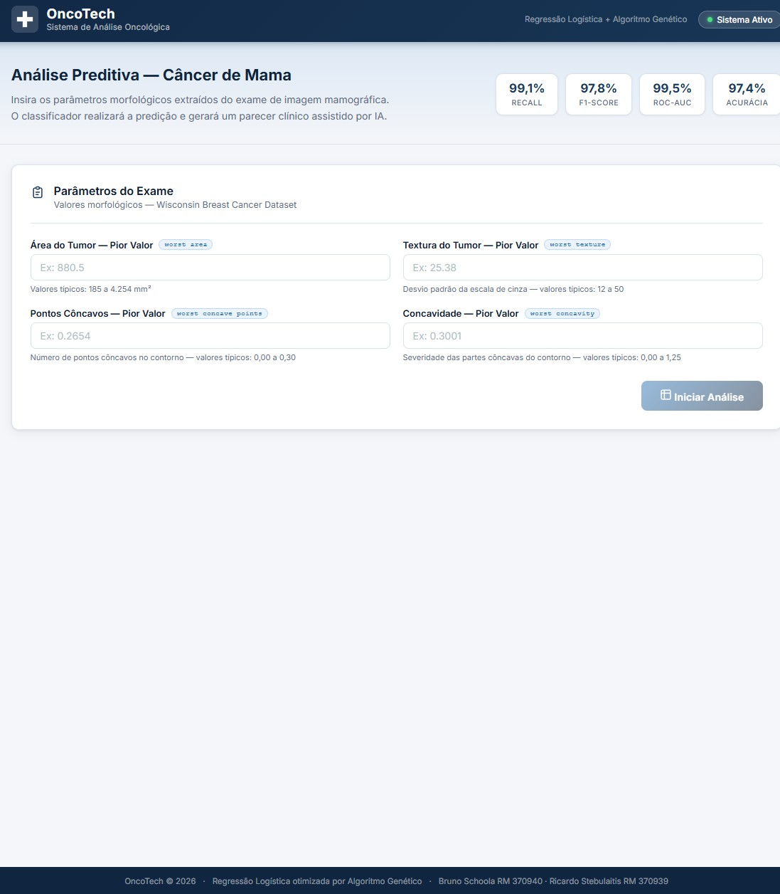
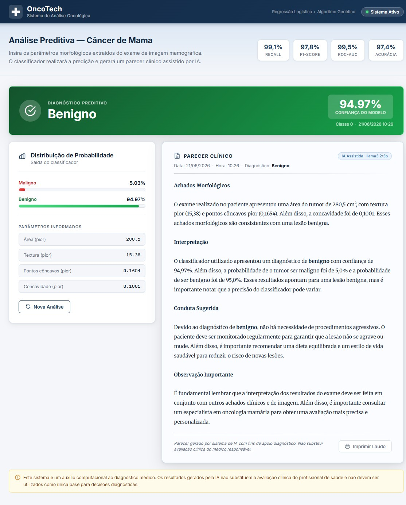

# Tech Challenge — OncoTech: Predição de Câncer de Mama com IA

Sistema completo de apoio ao diagnóstico médico composto por três projetos integrados: otimização de modelo com Algoritmo Genético, API de predição em Python com geração de laudo via LLM local, e interface clínica em Angular.

---

## Sumário

- [Interface Clínica](#interface-clínica)
- [Arquitetura](#arquitetura)
- [Como rodar — Docker (recomendado)](#como-rodar--docker-recomendado)
- [Como rodar — Localmente (sem Docker)](#como-rodar--localmente-sem-docker)
- [Fase 1 — Otimização com Algoritmo Genético](#fase-1--otimização-com-algoritmo-genético)
- [Fase 2 — API de Predição + LLM](#fase-2--api-de-predição--llm)
- [Fase 3 — Frontend Angular](#fase-3--frontend-angular-oncotech)

---

## Interface Clínica

| Formulário de entrada | Resultado + Laudo gerado por IA |
|:---:|:---:|
|  |  |

---

## Arquitetura

```
┌──────────────────────────────────────────────────────────────────┐
│  1.GenAIPrediction                                               │
│  Algoritmo Genético otimiza hiperparâmetros da Regressão         │
│  Logística → salva o modelo vencedor em ChoosenModel/            │
└──────────────────────────────┬───────────────────────────────────┘
                               │ cancer_model.joblib
┌──────────────────────────────▼───────────────────────────────────┐
│  2.PredictionApi  (FastAPI · localhost:8000)                     │
│  POST /predict/breastCancer       → diagnóstico + confiança      │
│  POST /predict/breastCancer/laudo → diagnóstico + laudo (LLM)    │
└──────────────────────────────┬───────────────────────────────────┘
                               │                    │
                    JSON result│          LLM prompt│
                               │    ┌───────────────▼──────────────┐
                               │    │  Ollama  (localhost:11434)   │
                               │    │  Modelo: llama3.2:3b         │
                               │    │  Gera laudo médico em PT-BR  │
                               │    └──────────────────────────────┘
                               │
┌──────────────────────────────▼───────────────────────────────────┐
│  3.Front  (Angular 17 · localhost:4200)                          │
│  Formulário → classificação imediata → laudo gerado por LLM      │
└──────────────────────────────────────────────────────────────────┘
```

---

## Estrutura do Repositório

```
AI-TechChallenge-PostDegree/
│
├── 1.GenAIPrediction/
│   ├── main.py                    # Pipeline: treina, compara e salva o melhor modelo
│   ├── config.py                  # Espaço de busca do AG e configurações dos experimentos
│   ├── requirements.txt
│   └── src/
│       ├── data_loader.py         # Carrega o dataset Wisconsin Breast Cancer
│       ├── preprocessing.py       # Feature engineering e divisão treino/teste
│       ├── models.py              # Pipeline: StandardScaler + LogisticRegression
│       ├── genetic_algorithm.py   # Seleção, cruzamento, mutação e elitismo
│       └── evaluation.py          # Métricas: F1, Recall, Accuracy, ROC-AUC
│
├── 2.PredictionApi/
│   ├── main.py                    # FastAPI: endpoints, schemas Pydantic, CORS, integração Ollama
│   ├── requirements.txt
│   ├── Dockerfile
│   └── PredictionApi.md           # Documentação detalhada da API
│
├── 3.Front/
│   ├── src/app/
│   │   ├── app.component.*        # Formulário + resultado + bloco de laudo
│   │   └── services/
│   │       └── prediction.service.ts
│   ├── nginx.conf                 # Config nginx para container Docker
│   └── Dockerfile
│
├── ChoosenModel/                  # Gerado ao rodar o projeto 1
│   ├── cancer_model.joblib
│   └── model_metadata.json
│
└──docker-compose.yml             # Orquestra: ollama + api + front
```

---

## Como rodar — Docker (recomendado)

> Requer apenas **Docker Desktop** instalado e em execução. Nenhuma outra dependência.

### GPU (importante para performance do laudo LLM)

Sem acesso à GPU, o Ollama roda em **CPU only** e o laudo pode levar mais de 1 minuto. O `docker-compose.yml` já inclui configuração de passthrough para **GPU NVIDIA** — mas requer o `nvidia-container-toolkit` instalado no host:

- **Instalar nvidia-container-toolkit:** https://docs.nvidia.com/datacenter/cloud-native/container-toolkit/install-guide.html
- Após instalar, reinicie o Docker Desktop e suba normalmente com `docker compose up --build`

**Mac com Apple Silicon (M1/M2/M3):** a GPU Metal não tem passthrough para Docker. A alternativa é rodar o Ollama no host e remover os serviços `ollama` e `ollama-setup` do compose, alterando a variável de ambiente da API:

```yaml
# em docker-compose.yml, serviço api:
environment:
  - OLLAMA_URL=http://host.docker.internal:11434
```

E no terminal do host:

```bash
ollama serve
```

**AMD / CPU only:** funciona sem configuração adicional, porém com latência elevada na geração do laudo.

---

```bash
docker compose up --build
```

O comando sobe automaticamente três serviços em ordem:

1. **ollama** — servidor de LLM (aguarda ficar saudável antes de continuar)
2. **ollama-setup** — faz o pull do modelo `llama3.2:3b` (~2 GB) na primeira execução; nas seguintes o modelo já está no volume e o pull é imediato
3. **prediction-api** — FastAPI com o classificador e integração com Ollama
4. **front** — Angular servido via nginx

Para acompanhar os logs em tempo real durante a inicialização, abra outro terminal e rode:

```bash
docker compose logs -f
```

Para ver apenas um serviço específico:

```bash
docker compose logs -f api
docker compose logs -f ollama
```

### URLs após inicialização

| Serviço | URL |
|---|---|
| Frontend | http://localhost:4200 |
| API (Swagger) | http://localhost:8000/docs |
| Ollama | http://localhost:11434 |

### Parar todos os serviços

```bash
docker compose down
```

---

## Como rodar — Localmente (sem Docker)

> Siga os passos na ordem. O modelo precisa existir antes de subir a API.

### Pré-requisitos

- Python 3.10+
- Node.js 20+ e Angular CLI (`npm install -g @angular/cli`)
- [Ollama](https://ollama.com/download) instalado localmente

### Passo 1 — Gerar o modelo

```bash
cd 1.GenAIPrediction
python -m venv venv

# Linux/Mac
source venv/bin/activate
# Windows
# venv\Scripts\activate

pip install -r requirements.txt
python main.py
```

Ao terminar, a pasta `ChoosenModel/` será criada com `cancer_model.joblib` e `model_metadata.json`.

### Passo 2 — Iniciar o Ollama e baixar o modelo

```bash
ollama serve                    # inicia o servidor (porta 11434)
ollama pull llama3.2:3b         # baixa o modelo (~2 GB, só na primeira vez)
```

### Passo 3 — Subir a API

```bash
cd 2.PredictionApi
python -m venv venv

# Linux/Mac
source venv/bin/activate
# Windows
# venv\Scripts\activate

pip install -r requirements.txt
uvicorn main:app --reload
```

API disponível em `http://localhost:8000` · Swagger UI em `http://localhost:8000/docs`

### Passo 4 — Subir o frontend

```bash
cd 3.Front
npm install
ng serve
```

Interface disponível em `http://localhost:4200`

---

## Fase 1 — Otimização com Algoritmo Genético

### Objetivo

Encontrar os melhores hiperparâmetros para um modelo de Regressão Logística que classifica tumores de mama como **Maligno** ou **Benigno** com máximo Recall — minimizando falsos negativos.

### Dataset

- **Fonte:** [Wisconsin Breast Cancer Dataset](https://github.com/bschoola/FIAP-Pos-AI/blob/main/Data/data.csv)
- **Features selecionadas:** `area_pior`, `textura_pior`, `pontos_concavos_pior`, `concavidade_pior`
- **Target:** `diagnostico` → Maligno (1) / Benigno (0)
- **Divisão:** 80% treino / 20% teste, estratificado

### Espaço de busca

| Hiperparâmetro | Valores possíveis |
|---|---|
| `C` (regularização) | 0.001 · 0.01 · 0.1 · 1 · 10 · 100 |
| `penalty` | l1 · l2 |
| `max_iter` | 100 · 200 · 500 · 1000 · 2000 |
| `class_weight` | None · balanced |

O AG representa cada combinação como um **cromossomo de 4 genes**. O **fitness** é o F1-Score médio em cross-validation de 5 folds.

### 3 Experimentos

| | Exp 1 | Exp 2 | Exp 3 |
|---|---|---|---|
| População | 10 | 20 | 30 |
| Gerações | 20 | 15 | 25 |
| Taxa de mutação | 30% | 20% | 10% |
| Taxa de cruzamento | 80% | 80% | 90% |
| Estratégia | Alta exploração | Balanceado | Alta explotação |

### Métricas

| Métrica | Descrição |
|---|---|
| **Recall** | % de tumores malignos reais detectados — métrica mais crítica clinicamente |
| **F1-Score** | Equilíbrio entre Precision e Recall — usado como fitness do AG |
| **ROC-AUC** | Capacidade de separação entre as duas classes |
| **Accuracy** | Taxa geral de acerto |

---

## Fase 2 — API de Predição + LLM
<!-- 
Documentação completa: [2.PredictionApi/PredictionApi.md](2.PredictionApi/PredictionApi.md) -->

### Endpoints

| Método | Rota | Descrição |
|---|---|---|
| `GET` | `/` | Redireciona para `/docs` (Swagger UI) |
| `GET` | `/docs` | Documentação interativa Swagger |
| `GET` | `/redoc` | Documentação ReDoc |
| `POST` | `/predict/breastCancer` | Predição rápida via classificador |
| `POST` | `/predict/breastCancer/laudo` | Predição + laudo médico gerado por LLM |
| `GET` | `/health` | Status da API, modelo carregado e conexão com Ollama |

---

### `POST /predict/breastCancer`

Executa apenas o classificador (Regressão Logística). Resposta rápida, sem LLM.

**Request:**
```json
{
  "area_pior": 880.5,
  "textura_pior": 25.38,
  "pontos_concavos_pior": 0.2654,
  "concavidade_pior": 0.3001
}
```

**Response `200`:**
```json
{
  "diagnostico": "Maligno",
  "confianca": 94.73,
  "classe": 1,
  "probabilidade_maligno": 0.9473,
  "probabilidade_benigno": 0.0527
}
```

| Campo | Tipo | Descrição |
|---|---|---|
| `diagnostico` | string | `"Maligno"` ou `"Benigno"` |
| `confianca` | float | Grau de confiança em % (0–100) |
| `classe` | int | `1` = Maligno, `0` = Benigno |
| `probabilidade_maligno` | float | Probabilidade bruta (0.0–1.0) |
| `probabilidade_benigno` | float | Probabilidade bruta (0.0–1.0) |

---

### `POST /predict/breastCancer/laudo`

Executa o classificador e enfileira a geração do laudo médico via LLM local (Ollama). Aceita o mesmo body do endpoint acima.

#### Arquitetura de fila para chamadas LLM

O Ollama processa requisições de forma sequencial — sem fila, múltiplas chamadas simultâneas causariam timeouts em cascata. Para suportar concorrência, o endpoint usa **Celery + Redis**: o POST retorna imediatamente com um `task_id` e um worker processa os laudos na ordem de chegada.

```
Cliente
  │
  ├─ POST /predict/breastCancer/laudo
  │         ◄── { task_id, diagnostico, confianca }   (resposta imediata)
  │
  └─ GET /predict/breastCancer/laudo/status/{task_id}  (polling até concluir)
             ◄── { status: "pending" | "processing" | "completed" | "failed" }
```

| Etapa | Responsável | Latência esperada |
|---|---|---|
| Classificador ML | FastAPI (síncrono) | < 50 ms |
| Enqueue na fila | Redis | < 100 ms |
| Geração do laudo | Celery worker → Ollama | 10–60 s (varia com hardware) |

Aceita o mesmo body do endpoint acima.

**Response `200`:**
```json
{
  "diagnostico": "Maligno",
  "confianca": 94.73,
  "classe": 1,
  "probabilidade_maligno": 0.9473,
  "probabilidade_benigno": 0.0527,
  "laudo": "**Achados morfológicos**\nOs parâmetros morfológicos indicam área tumoral elevada (880.5 mm²)...\n\n**Interpretação**\nO classificador atribuiu diagnóstico de malignidade com 94.73% de confiança...\n\n**Conduta sugerida**\nRecomenda-se encaminhamento para equipe de oncologia...\n\n**Observação importante**\nEste laudo é auxiliar e deve ser validado por médico responsável."
}
```

> O campo `laudo` utiliza markdown (`**negrito**`) renderizado pelo frontend.

**Códigos de erro:**

| Código | Descrição |
|---|---|
| `502` | Falha na comunicação com o Ollama |
| `503` | Modelo classificador ou LLM não carregados |

---

### `GET /health`

Verifica o status de todos os componentes da API.

**Response `200`:**
```json
{
  "status": "ok",
  "model_loaded": true,
  "llm_available": true,
  "ollama_url": "http://ollama:11434",
  "ollama_model": "llama3.2:3b",
  "model_experiment": "experiment_3",
  "model_metrics": {
    "f1": 0.978,
    "recall": 0.991,
    "accuracy": 0.974,
    "roc_auc": 0.995
  }
}
```

---

### Stack

- **Framework:** FastAPI + Uvicorn
- **Serialização do modelo:** joblib
- **Validação:** Pydantic v2
- **LLM:** Ollama via cliente OpenAI-compatível (`openai` Python SDK)
- **Modelo LLM:** llama3.2:3b (roda localmente, sem dependência de nuvem)

---

## Fase 3 — Frontend Angular (OncoTech)

### Fluxo de uso

1. Médico preenche os 4 parâmetros do exame de imagem
2. O resultado do classificador aparece imediatamente (rápido)
3. O laudo médico em linguagem clínica é gerado pela LLM e exibido logo em seguida

### Telas

**Formulário de entrada** — 4 campos com descrição clínica, hint de valores típicos e validação

**Tela de resultado**
- Badge colorido: **MALIGNO** (vermelho) ou **BENIGNO** (verde) com percentual de confiança
- Barras de probabilidade para cada classe
- Bloco de laudo médico gerado por IA com indicador de carregamento

### Stack

- **Framework:** Angular 17 standalone
- **HTTP:** `HttpClient` via `PredictionService`
- **Estilo:** CSS customizado, tema hospitalar azul, responsivo

---

## Aviso

Este sistema é um projeto acadêmico de pós-graduação. Os resultados gerados pela IA **não substituem** a avaliação clínica do profissional de saúde e não devem ser usados como única base para decisões diagnósticas.
