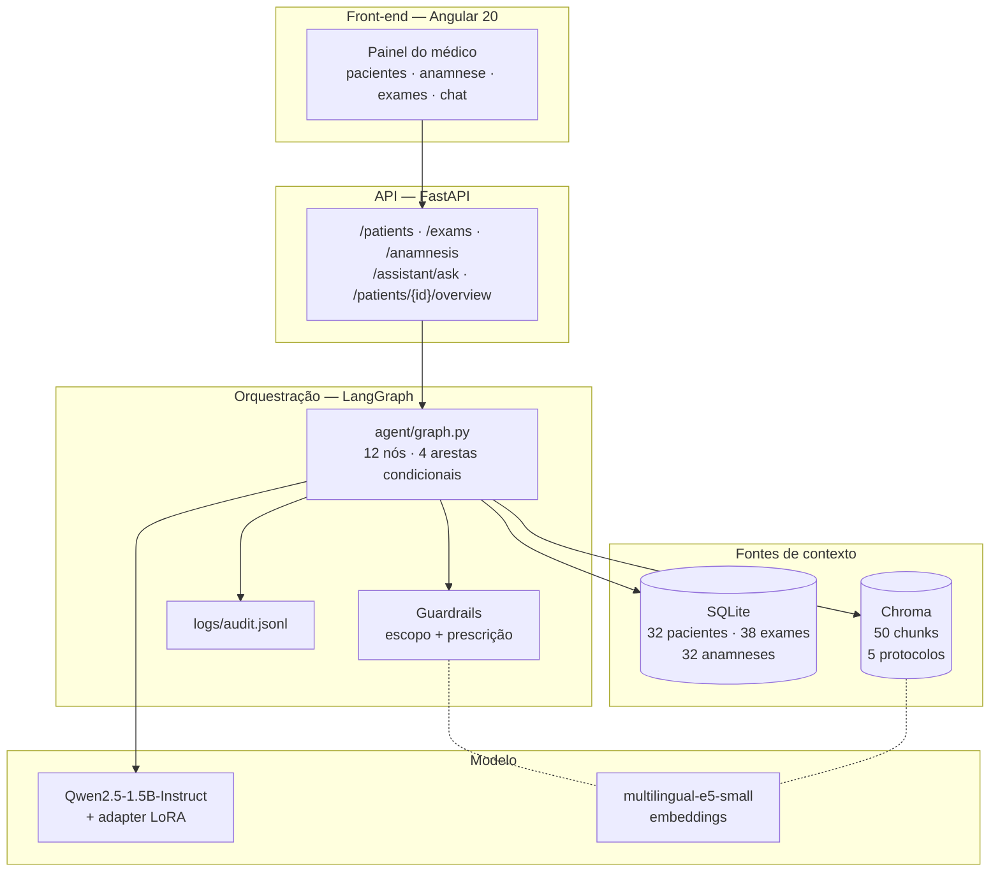
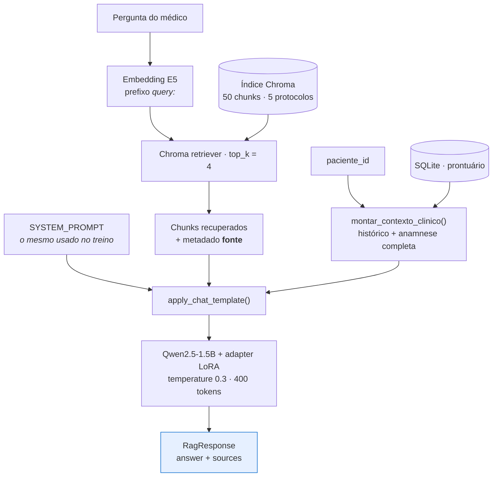
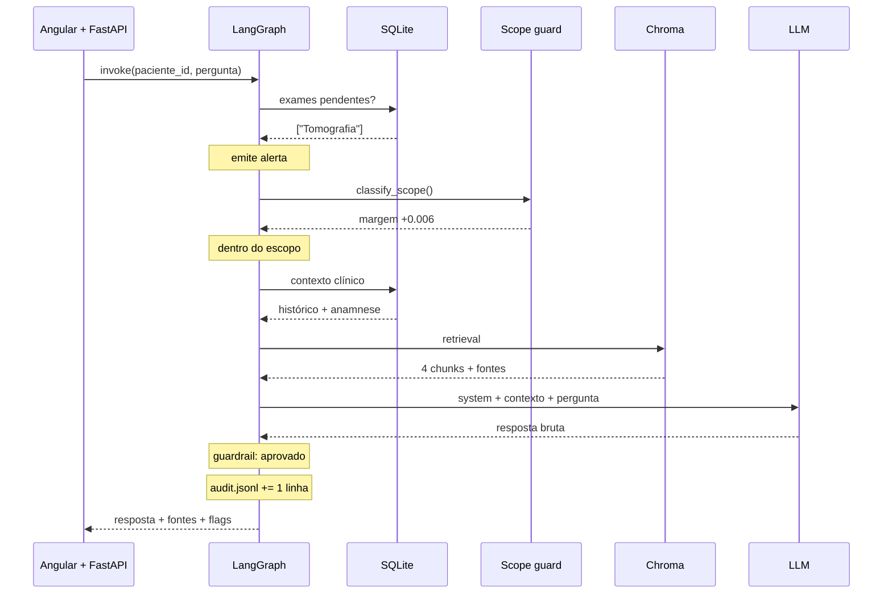

# Relatório Técnico — OncoTech: Assistente Médico Virtual

**Tech Challenge — Fase 3 · Pós-graduação em Inteligência Artificial (FIAP)**
Repositório: `AI-TechChallenge-Step3` · Documento gerado em 06/09/2026

---

## Sumário

1. [Resumo executivo](#1-resumo-executivo)
2. [Processo de fine-tuning](#2-processo-de-fine-tuning)
3. [O assistente médico criado](#3-o-assistente-médico-criado)
4. [Diagrama do fluxo LangChain / LangGraph](#4-diagrama-do-fluxo-langchain--langgraph)
5. [Avaliação do modelo e análise dos resultados](#5-avaliação-do-modelo-e-análise-dos-resultados)
6. [Limitações conhecidas e trabalhos futuros](#6-limitações-conhecidas-e-trabalhos-futuros)
7. [Referências e licenças](#7-referências-e-licenças)

---

## 1. Resumo executivo

Este trabalho implementa um **assistente médico virtual de apoio à decisão clínica** para um hospital fictício ("Hospital Vida Nova", com o painel do médico apresentado sob a marca "Hospital VEinstein"), no domínio de **oncologia mamária**. O sistema não substitui o julgamento clínico: ele organiza informação do prontuário, recupera protocolos internos e redige respostas que precisam ser validadas por um profissional habilitado.

A entrega combina três técnicas com papéis deliberadamente distintos:

| Técnica | Papel | Por que não dá para usar só ela |
|---|---|---|
| **Fine-tuning (QLoRA)** | Estilo, tom clínico, formato de resposta e vocabulário do domínio | Não sabe o dado do paciente de hoje, e não tem como citar fonte |
| **RAG (LangChain + Chroma)** | Conhecimento factual **citável** — os protocolos internos | Não muda o comportamento do modelo; sozinho, herda o tom genérico do modelo base |
| **Tools sobre banco estruturado** | Dado do paciente **em tempo real** (histórico, anamnese, exames) | Muda a cada consulta; congelar isso em pesos seria errado por construção |

A orquestração é feita por um **grafo de estados em LangGraph**, que decide o caminho de execução conforme o tipo de interação e o resultado dos guardrails, e registra cada interação num log de auditoria.

**Números da entrega:**

| Item | Valor |
|---|---|
| Modelo base | `Qwen/Qwen2.5-1.5B-Instruct` (Apache 2.0) |
| Técnica de fine-tuning | QLoRA 4-bit (NF4) + LoRA r=16 |
| Parâmetros treináveis | ≈ 4,36 M (0,28% do total) |
| Dataset de fine-tuning | 55 exemplos (47 treino / 8 validação) |
| Base de conhecimento (RAG) | 5 protocolos → 50 chunks no Chroma |
| Prontuário simulado | 32 pacientes, 38 exames, 32 anamneses completas |
| Nós no grafo LangGraph | 12, com 4 arestas condicionais |
| Interações registradas em auditoria | 68 (05–06/09/2026) |
| Testes automatizados | 38, todos passando |

---

## 2. Processo de fine-tuning

### 2.1 Por que fine-tuning e não só prompt engineering

O desafio pede explicitamente um modelo customizado com dados médicos. Independentemente disso, há uma justificativa técnica: o que se quer do modelo aqui é **comportamento**, não conhecimento. Um modelo de 1,5 B parâmetros responde perguntas médicas em português com tom de enciclopédia geral, em primeira pessoa e frequentemente com formatação de chatbot. O alvo é uma resposta curta, em registro clínico, que enquadre qualquer conduta como sugestão sujeita à validação de um médico responsável e que cite o protocolo em que se apoia.

Esse tipo de ajuste — formato e tom, com pouco conteúdo novo — é exatamente o caso em que **LoRA/QLoRA com poucas centenas de exemplos** funciona bem e o RAG não resolve: o RAG muda o que o modelo *sabe*, não como ele *escreve*.

### 2.2 Composição e origem do dataset

O dataset de treino é montado a partir de duas pastas em `data/raw/`, cada uma com um propósito:

| Fonte | Arquivos | Papel no treino | Origem |
|---|---:|---|---|
| `faqs/` | 51 | Pares instrução→resposta clínica | **MedQuAD** (NIH) e **PubMedQA**, filtrados para câncer de mama e traduzidos para PT-BR |
| `laudos_modelo/` | 5 | Formato e tom de documentos (laudo, parecer, encaminhamento, orientação pós-procedimento) | Sintético, escrito para o hospital fictício |
| `protocolos/` | 5 | **Não entram no fine-tuning** — alimentam o RAG | Sintético |

A separação entre `faqs/`+`laudos_modelo/` (fine-tuning) e `protocolos/` (RAG) é uma decisão de arquitetura, não uma limitação de tempo: protocolo é *conhecimento a consultar e citar*, e treinar o modelo nele destruiria a rastreabilidade — o modelo passaria a "saber" o protocolo sem conseguir apontar de onde tirou a informação, que é justamente o requisito de explainability do desafio.

**Composição por origem das 51 FAQs** (identificável pelo prefixo do nome do arquivo):

| Prefixo | Sub-base | Arquivos |
|---|---|---:|
| `cancergov_` | MedQuAD / CancerGov | 17 |
| `pubmedqa_` | PubMedQA | 15 |
| `seniorhealth_` | MedQuAD / SeniorHealth | 8 |
| `gard_` | MedQuAD / GARD | 5 |
| `ghr_` | MedQuAD / Genetics Home Reference | 3 |
| `mplustopics_` | MedQuAD / MedlinePlus Health Topics | 3 |

#### Decisão consciente: troca do dataset sintético por bases públicas

O PDF do desafio pede fine-tuning com "dados médicos internos" do hospital fictício, e a primeira versão do projeto tinha 12 FAQs sintéticas escritas para o Hospital Vida Nova. Elas foram **substituídas** por conteúdo derivado de MedQuAD e PubMedQA — as duas bases sugeridas pela própria FIAP no enunciado.

Trade-off assumido, com os olhos abertos:

- **Ganho:** conteúdo clínico real, revisado por instituições (NIH), com volume e variedade que dados sintéticos escritos às pressas não teriam. O modelo aprende sobre linfedema, mutações BRCA, estadiamento e inibidores de aromatase a partir de material de referência, não de invenção.
- **Perda:** as FAQs deixam de ser "dado interno do hospital". Isso é um desvio literal do enunciado, registrado aqui como decisão e não como omissão. Os `protocolos/` e os `laudos_modelo/` permanecem sintéticos e internos ao hospital fictício — não há equivalente de laudo ou receita nas bases públicas.
- **Risco residual:** a tradução e o resumo para PT-BR foram feitos **com apoio de LLM, sem revisão manual por profissional de saúde**. Há risco de imprecisão terminológica. O conteúdo deve ser tratado como material de estudo, jamais como fonte validada para uso clínico. As FAQs sintéticas originais foram arquivadas, não apagadas (`data/raw/_arquivado_sintetico_hospital_vida_nova/`).

O PubMedQA exigiu mais do que tradução: seu formato original é *pergunta de pesquisa + abstract + conclusão sim/não/talvez*, incompatível com um par instrução→resposta clínica. Cada item foi reescrito como pergunta e resposta em prosa, preservando a conclusão do estudo.

#### Anonimização

Não houve dado real de paciente em nenhuma etapa. MedQuAD e PubMedQA são bases públicas de conhecimento médico, sem informação identificável. O prontuário simulado (`prontuarios_mock.db`) é 100% gerado, com nomes explicitamente fictícios ("Paciente Fictício A" … "Paciente Fictício AF"). A anonimização, aqui, é estrutural: não existe dado sensível a anonimizar.

### 2.3 Preprocessing e curadoria

`finetuning/prepare_dataset.py` transforma os arquivos Markdown em JSONL no formato Alpaca (`instruction` / `input` / `output`):


Escolhas de implementação que importam:

- **Cabeçalhos tolerantes.** O parser aceita `## Instrução`, `## Pergunta` ou `## Contexto` para a entrada e `## Resposta`, `## Laudo`, `## Receita`, `## Parecer` ou `## Encaminhamento` para a saída, normalizando acento e caixa. Isso permitiu trocar toda a fonte das FAQs sem alterar uma linha do script de preparação.
- **Split determinístico** (`RANDOM_STATE = 42`): o conjunto de validação é sempre o mesmo, então as métricas da seção 5 são comparáveis entre execuções.
- **Filtro de comprimento mínimo** (20 caracteres na resposta): descarta respostas truncadas na conversão, que ensinariam o modelo a parar cedo.

**Perfil do dataset resultante:**

| Métrica | Valor |
|---|---|
| Exemplos totais | 55 (47 treino / 8 validação) |
| Palavras por instrução | média 15,1 · mín. 8 · máx. 22 |
| Palavras por resposta | média 94,2 · mín. 63 · máx. 138 |
| Volume total de resposta | ≈ 5.200 palavras |

O dataset é **pequeno**, e isso é assumido: o objetivo é ajustar formato e tom, não injetar conhecimento. É também a origem direta de várias limitações analisadas na seção 5.

### 2.4 Configuração do treino

**Modelo base: `Qwen/Qwen2.5-1.5B-Instruct`.** A escolha foi guiada por três restrições combinadas: licença Apache 2.0 sem gate de acesso (evita travar a entrega esperando aprovação no Hugging Face), suporte multilíngue real a PT-BR e caber com folga em QLoRA 4-bit na GPU T4 do Colab gratuito. O plano original previa o Qwen2.5-3B; a versão de 1,5 B foi adotada para reduzir o tempo de treino e o risco de perder a sessão do Colab no meio do processo.

**QLoRA** — quantizar o modelo base em 4 bits (NF4, com dupla quantização) e treinar apenas adaptadores de baixo posto (LoRA) por cima. O modelo base fica congelado e quantizado; só as matrizes LoRA recebem gradiente:

| Hiperparâmetro | Valor | Justificativa |
|---|---|---|
| `LORA_R` | 16 | Posto suficiente para ajuste de estilo; valores maiores só aumentariam o risco de overfit em 47 exemplos |
| `LORA_ALPHA` | 32 | Razão α/r = 2, convenção usual |
| `LORA_DROPOUT` | 0.05 | Regularização leve, apropriada ao dataset pequeno |
| `LORA_TARGET_MODULES` | `q_proj`, `k_proj`, `v_proj`, `o_proj` | Só as projeções de atenção. Incluir as camadas MLP aumentaria muito os parâmetros treináveis sem ganho claro para ajuste de tom |
| `LOAD_IN_4BIT` | `True` (NF4 + double quant) | Reduz a memória do modelo base a ponto de caber na T4 |
| `NUM_TRAIN_EPOCHS` | 3 | Com 47 exemplos, mais épocas memorizam o conjunto |
| Batch efetivo | 8 (2 × 4 de acumulação) | Batch real de 2 cabe na VRAM da T4; a acumulação recupera a estabilidade do gradiente |
| `LEARNING_RATE` | 2e-4 | Padrão para LoRA (bem acima do usado em fine-tuning completo) |
| `MAX_SEQ_LENGTH` | 1024 | Acomoda com folga o maior exemplo (system prompt + instrução + resposta) |

**Volume de treino:** 47 exemplos ÷ batch efetivo 8 ≈ 6 passos por época × 3 épocas = **18 passos de otimização**. Os checkpoints salvos no adapter (`checkpoint-6`, `checkpoint-12`, `checkpoint-18`) confirmam esse cálculo.

**Parâmetros treináveis:** com r=16 sobre as quatro projeções de atenção, em 28 camadas de um modelo com `hidden_size=1536` e atenção agrupada (12 cabeças de consulta, 2 de chave/valor), o total é ≈ **4,36 milhões de parâmetros**, ou **0,28%** dos ≈ 1,54 bilhão do modelo. O arquivo `adapter_model.safetensors` de 17,4 MB confirma a ordem de grandeza (4,36 M × 4 bytes ≈ 17,4 MB).

**Formatação do prompt de treino.** Este é o detalhe que mais silenciosamente quebra um fine-tuning e por isso foi centralizado no código: `SYSTEM_PROMPT` vive num único lugar (`finetuning/config.py`) e é usado **tanto no treino** (`train_qlora.py::build_prompt`) **quanto na inferência** (`rag/chain.py::ask` e `ask_overview`), sempre através do `apply_chat_template` do tokenizer. Se treino e runtime usassem templates diferentes, o adapter simplesmente não se comportaria como treinado — e o sintoma seria confundido com "o fine-tuning não funcionou".

O mesmo raciocínio se aplica ao conteúdo do system prompt: ele descreve exatamente os limites que o guardrail de runtime (`agent/guardrails.py`) depois verifica. O modelo é treinado para respeitar a regra que o sistema vai fiscalizar, não uma regra diferente.

### 2.5 Execução

O treino foi executado na **GPU T4 gratuita do Google Colab** (`finetuning/train_qlora_colab.ipynb`), com o adapter salvo no Google Drive a cada época para sobreviver a quedas de sessão. Stack: `transformers` + `peft` 0.20 + `trl` 1.12 (`SFTTrainer`) + `bitsandbytes` + `accelerate`.

`finetuning/train_qlora.py` também roda **localmente sem GPU**: detecta a ausência de CUDA e carrega o modelo sem quantização em bfloat16 (LoRA "cru", não QLoRA — `bitsandbytes` 4-bit exige CUDA), habilitando *gradient checkpointing* manualmente para compensar a memória. Funciona, mas é ordens de magnitude mais lento. O mesmo cuidado aparece na escolha do dtype de computação: `"auto"` resolve para bfloat16 em GPUs Ampere+ e float16 na T4, que não suporta bf16 nativamente.

**Artefato final:** `finetuning/adapters/cancer-assistant-lora/` — adapter LoRA (17,4 MB) + tokenizer + chat template. O modelo base não é redistribuído; é baixado do Hugging Face na primeira execução.

---

## 3. O assistente médico criado

### 3.1 O que ele faz

O assistente vive dentro do painel do médico ("Hospital VEinstein", Angular 20) e atua em **dois modos**, com caminhos diferentes no grafo:

**Modo 1 — Visão geral automática.** Ao abrir a ficha de um paciente, o front-end dispara `POST /patients/{id}/overview`. O assistente lê o histórico, a anamnese completa e os exames, e devolve duas listas estruturadas: **pontos relevantes** (síntese do caso) e **pontos de atenção** (riscos, exames pendentes, alergias, divergências entre histórico e conduta). O médico vê isso como um card ao lado da ficha, sem precisar perguntar nada.

**Modo 2 — Chat.** O médico faz uma pergunta livre sobre o paciente em consulta (`POST /assistant/ask`). A resposta é ancorada nos protocolos internos recuperados via RAG, e traz a lista de protocolos consultados.

Nos dois modos, se o paciente tiver exames pendentes, um alerta é emitido antes da geração e acompanha a resposta.

#### Por que dois modos, e não um só

Esta é uma correção de rota que vale registrar, porque foi descoberta em uso real e não no papel. Na primeira versão, a visão geral reusava o caminho do chat, com uma pergunta fixa pedindo ao modelo para "revisar a anamnese". O resultado foi que o modelo **parafraseava de volta a própria ficha** — que já estava visível do lado esquerdo da tela — em vez de destacar o que era clinicamente relevante.

O diagnóstico: um modelo pequeno, treinado majoritariamente em QA factual (MedQuAD/PubMedQA), tende a ser **extrativo**, não analítico. Dado um bloco de texto e um pedido vago, ele devolve o bloco reorganizado.

A correção foi separar os dois caminhos no grafo (campo `tipo_interacao` no estado) e dar à visão geral um prompt próprio, que pede um **formato de saída fixo** com marcadores `RELEVANTE:` e `ATENCAO:`, listas de até 5 itens, e instrução explícita para não repetir a ficha. O backend parseia essa saída em duas listas. Os nós comuns — checagem de exames, guardrails, validação humana, auditoria — continuam compartilhados: um grafo, dois caminhos de geração, nenhuma duplicação de pipeline.

### 3.2 Componentes



| Componente | Tecnologia | Papel |
|---|---|---|
| Orquestração | LangGraph | Grafo de estados; decide o caminho e garante que todo caminho passe por guardrail e auditoria |
| Geração | `transformers` + `peft`, via `HuggingFacePipeline` | Modelo base + adapter LoRA, servido em processo |
| Recuperação | LangChain + Chroma | 50 chunks (500 caracteres, overlap 50) dos 5 protocolos, com metadado `fonte` preservado desde a leitura |
| Embeddings | `intfloat/multilingual-e5-small` | Usado no RAG **e** no guardrail de escopo |
| Prontuário | SQLite | Tabelas `pacientes`, `exames`, `anamnese`; seed idempotente |
| API | FastAPI + Pydantic | Grafo carregado uma vez no `lifespan`, não por requisição |
| Front-end | Angular 20 (standalone + Signals) + Material | Painel do médico |

Uma particularidade do E5 tratada explicitamente: a família `intfloat/multilingual-e5-*` exige os prefixos `passage:` para documentos e `query:` para buscas. Isso está encapsulado numa subclasse (`rag/embeddings.py::E5Embeddings`) usada tanto na ingestão quanto na busca — se um lado usasse o prefixo e o outro não, a qualidade de recuperação cairia **silenciosamente**, sem erro nenhum.

### 3.3 Segurança, guardrails e explainability

O desafio pede limites de atuação, logging e explainability. A implementação distribui isso em cinco camadas:

**1. System prompt compartilhado.** Um único texto em `finetuning/config.py`, usado no treino e no runtime, com três regras: usar o contexto fornecido; dizer explicitamente quando o contexto for insuficiente; **nunca prescrever diretamente** — sempre enquadrar como recomendação a ser validada por médico responsável.

**2. Guardrail de escopo** (`agent/scope_guard.py`) — camada *anterior* à geração, só no caminho do chat. Classifica a pergunta por similaridade de embeddings **antes** de montar o contexto do paciente. Se estiver fora do domínio clínico, o grafo desvia para uma resposta fixa em código, que **nunca chega a ver o prontuário**.

O motivo dessa camada existir é concreto: perguntas fora do domínio faziam o modelo tentar recusar e, no mesmo texto, misturar pedaços do contexto do paciente que estava no prompt. A causa é estrutural — o pipeline sempre injetava o prontuário e deixava o próprio LLM decidir, em texto livre, se responderia. Um modelo pequeno, com dado clínico disponível no contexto, tende a "completar" em vez de recusar secamente. A calibração dessa camada rendeu o resultado mais interessante da avaliação (seção 5.2).

**3. Guardrail de prescrição** (`agent/guardrails.py`) — filtro de expressões regulares aplicado a **toda** resposta, em todos os caminhos, procurando linguagem de prescrição direta (`prescrevo`, `receito`, `tome … mg`, `administre … dose`). A resposta **nunca é descartada em silêncio**: se algum padrão dispara, ela é marcada com `requer_validacao_humana=True` e recebe um aviso anexado — o médico vê o rascunho, sinalizado.

A escolha por regex, e não por um classificador de ML, é deliberada: em contexto acadêmico e clínico, um filtro simples e auditável é mais defensável do que uma caixa-preta sem explicação. Ele é conservador por construção, preferindo falso-positivo a falso-negativo.

**4. Nó de validação humana.** Respostas sinalizadas passam por um nó dedicado que marca `status="aguardando_validacao_humana"`. O fluxo não é interrompido — a decisão sobre o que fazer com um rascunho sinalizado é do médico, não do sistema.

**5. Explainability em duas frentes.** Toda resposta de chat cita os protocolos recuperados (o metadado `fonte` é preservado desde a leitura do arquivo, antes do chunking, e volta no campo `fontes` da API). E o log de auditoria (`logs/audit.jsonl`) grava, por interação: timestamp, tipo de interação, paciente, pergunta, decisão e **similaridades numéricas** do guardrail de escopo, exames pendentes, alerta, fontes citadas, resposta bruta, resposta final, pontos estruturados, padrões sinalizados e status. Uma linha JSON por interação, em modo *append*, e a escrita nunca derruba uma resposta já gerada.

Esse log não é decorativo: **foi ele que permitiu diagnosticar todos os problemas descritos na seção 5.**

---

## 4. Diagrama do fluxo LangChain / LangGraph

### 4.1 Grafo de decisão (LangGraph)


**Leitura do grafo.** Quatro arestas condicionais governam o fluxo:

| Aresta condicional | Decisão baseada em | Caminhos |
|---|---|---|
| `verificar_exames_pendentes` | Consulta ao SQLite | `com_pendencia` → emite alerta · `sem_pendencia` → segue |
| `rotear_geracao` | Campo `tipo_interacao` do estado | `chat` → classificação de escopo · `visao_geral` → geração direta |
| `classificar_escopo` | Similaridade relativa de embeddings | `dentro_do_escopo` → RAG + geração · `fora_de_escopo` → resposta fixa |
| `validar_seguranca` | Resultado do filtro de prescrição | `sinalizado` → validação humana · `aprovado` → finaliza |

Três propriedades estruturais que o desenho garante:

1. **`log_auditoria` é terminal e sempre executado.** Não existe caminho de saída que não passe por ele — nem o de recusa por escopo, nem o de resposta sinalizada.
2. **`validar_seguranca` é o ponto de convergência obrigatório.** Os três nós de geração (RAG, visão geral, recusa) convergem nele. Nenhuma resposta escapa do guardrail, nem mesmo a resposta fixa de fora de escopo.
3. **`rotear_geracao` é um nó de passagem, sem efeito no estado.** Existe apenas para dar um ponto único de saída aos dois caminhos anteriores (com e sem exame pendente), evitando duplicar a aresta condicional de tipo de interação.

### 4.2 Chain de recuperação e geração (LangChain)



Duas decisões de implementação merecem nota:

- **A chain não é uma única `Runnable` LCEL encadeada.** Ela é montada como um dicionário de componentes (`retriever`, `llm_chat`, `llm_overview`, `tokenizer`), porque `ask()` precisa **tanto da resposta gerada quanto dos metadados de fonte dos chunks** — informação que se perde numa chain LCEL que devolve apenas a string final. A explainability exigida pelo desafio ditou a estrutura da chain.

- **Dois wrappers de pipeline sobre o mesmo modelo.** `llm_chat` (400 tokens) e `llm_overview` (800 tokens) compartilham o mesmo `model` e `tokenizer` carregados — não há peso duplicado em memória, apenas duas configurações de geração. Isso resolveu um bug real de truncamento (seção 5.4).

A visão geral usa uma variante desse fluxo: **sem retrieval**. O insumo é o caso do paciente, não os protocolos do hospital, então a chamada ao Chroma seria ruído.

### 4.3 Sequência ponta a ponta (chat)



---

## 5. Avaliação do modelo e análise dos resultados

Esta seção tem duas partes com naturezas diferentes, e vale distingui-las: a **avaliação comparativa** (base vs. fine-tuned, com métricas automáticas) e a **análise de comportamento em uso real**, baseada nas 68 interações registradas no log de auditoria entre 05 e 06/09/2026. A segunda é, honestamente, a mais informativa — foi ela que produziu correções concretas no sistema.

### 5.1 Metodologia da avaliação comparativa

`finetuning/evaluate.py` gera, para o mesmo conjunto de perguntas, as respostas do **modelo base "cru"** e do **modelo base + adapter LoRA**, e calcula métricas comparáveis.

**Conjunto de teste:** as 8 perguntas de `dataset_val.jsonl` — o split de validação, que nunca foi usado para atualizar pesos (o `SFTTrainer` o consome apenas como `eval_dataset` para a loss). Cobre 6 perguntas clínicas (linfedema pós-cirúrgico, mutações somáticas vs. germinativas, sinais de alerta, câncer de mama masculino, tipos de tratamento, síndrome BRCA1) e 2 pedidos de geração de documento (encaminhamento para oncologia, orientação pós-biópsia).

**Métricas.** Nenhuma delas mede correção clínica — isso exigiria um médico avaliando as respostas, o que está fora do escopo deste trabalho. O que elas medem é se o fine-tuning aproximou o **comportamento** do modelo do comportamento-alvo:

| Métrica | O que mede | Direção |
|---|---|---|
| `similaridade_referencia` | Cosseno entre o embedding da resposta gerada e o da resposta de referência (mesmo E5 do RAG). Proxy de "falou sobre a mesma coisa", **não** de "falou certo" | maior |
| `taxa_guardrail` | Fração de respostas que o filtro de prescrição sinalizaria. Reusa o **mesmo** `agent/guardrails.py` do runtime | menor |
| `taxa_ressalva` | Fração de respostas que enquadram explicitamente a informação como sujeita a validação profissional | maior |
| `distinct_3` | Proporção de trigramas distintos. Detector de degeneração por repetição | maior |
| `comprimento_palavras` | Média de palavras por resposta. Não é "melhor maior" — mostra se o regime de verbosidade mudou | — |

**Controles metodológicos:**

- **Geração greedy** (`do_sample=False`) em vez da amostragem do runtime (`temperature=0.3`), para que a comparação seja reproduzível entre execuções. Isso significa que os números daqui **não reproduzem exatamente** o que a API responde em produção.
- **Sem RAG**, para isolar o efeito do fine-tuning. As respostas da API passam ainda por retrieval e pelo grafo.
- **Mesmo prompt e mesmo chat template** dos dois lados, idênticos aos do treino. Se o template divergisse, a métrica mediria a divergência de template, não o efeito do fine-tuning.
- **Modelos carregados em sequência**, não simultaneamente — em CPU, manter os dois na RAM dobraria o consumo sem necessidade.
- Um cuidado sobre a métrica de similaridade: o `multilingual-e5-small` tem um **piso alto** de similaridade entre quaisquer dois textos em português. O valor absoluto importa menos que a **diferença** entre base e fine-tuned no mesmo item.

```bash
python finetuning/evaluate.py
# → data/processed/evaluation/evaluation.json   (respostas completas + métricas por item)
# → data/processed/evaluation/evaluation.md     (tabela comparativa)
```

> **Status:** o script está implementado e validado (12 testes automatizados sobre a lógica de métricas e renderização). A execução exige carregar o modelo base e o adapter, o que depende de GPU ou de tempo considerável em CPU. Os números agregados devem ser colados aqui a partir de `evaluation.md` após a execução.

| Métrica | Base | Fine-tuned | Δ |
|---|---:|---:|---:|
| Similaridade com a referência | _a preencher_ | _a preencher_ | |
| Taxa de acionamento do guardrail | _a preencher_ | _a preencher_ | |
| Taxa de ressalva de validação | _a preencher_ | _a preencher_ | |
| Trigramas distintos | _a preencher_ | _a preencher_ | |
| Comprimento médio (palavras) | _a preencher_ | _a preencher_ | |

**Hipóteses a testar com esses números**, declaradas antes da execução para que o resultado seja interpretável e não retroajustado:

1. A **taxa de ressalva** deve subir no fine-tuned — é o comportamento mais diretamente ensinado pelo system prompt repetido em 47 exemplos.
2. O **comprimento médio** deve cair — as respostas de referência têm 94 palavras em média, bem menos do que o modelo base produz espontaneamente.
3. A **similaridade com a referência** deve subir modestamente. Uma subida grande seria suspeita de memorização, não de generalização, com um dataset deste tamanho.
4. Os **trigramas distintos** podem *cair* no fine-tuned. Fine-tuning agressivo em dataset pequeno aumenta a propensão a loops — e a seção 5.4 mostra que isso de fato ocorre em produção.

### 5.2 Resultado principal: calibração do guardrail de escopo

Este é o achado mais substantivo da avaliação, e ilustra por que testar com dado real importa.

**Versão 1 — limiar absoluto.** A primeira implementação comparava a pergunta apenas contra âncoras "dentro do escopo", classificando como clínica se a similaridade máxima superasse 0,75. Em teste real, perguntas obviamente fora do domínio passaram:

| Pergunta (fora do escopo) | Similaridade contra âncoras clínicas | Decisão v1 |
|---|---:|---|
| "É um bom momento para viajar para a Jamaica?" | 0,843 | ✗ aceita |
| "Qual melhor bola de futebol para comprar?" | 0,819 | ✗ aceita |
| "Devo trocar a vela de ignição a cada 12 meses?" | 0,851 | ✗ aceita |
| "Devo trocar a vela de ignição do meu carro a cada 12 meses?" | 0,841 | ✗ aceita |

**Causa raiz:** o `multilingual-e5-small` tem um **piso de similaridade de ~0,80** entre quaisquer duas frases curtas em português, produzido pela forma interrogativa e pelo registro formal, independentemente do assunto. Um limiar absoluto não consegue separar esse piso do sinal real de tópico. Elevar o limiar para 0,86 não resolveria — apenas moveria o problema para o outro lado, rejeitando perguntas clínicas legítimas.

**Versão 2 — comparação relativa** (abordagem de *semantic router*). Introduziu-se um segundo conjunto de âncoras, do que está **fora** do escopo (viagem, carro, esporte, clima, culinária, finanças). A pergunta só é aceita quando a similaridade contra as âncoras clínicas supera a similaridade contra as âncoras fora de escopo. O piso comum aos dois lados se cancela, e sobra o sinal de tópico:

| Pergunta | Dentro | Fora | Margem | Decisão v2 |
|---|---:|---:|---:|---|
| "Devo trocar a vela de ignição do meu carro de 12 em 12 meses?" | 0,847 | 0,921 | **−0,075** | ✓ rejeita |
| "Qual o melhor dia para comer feijoada?" | 0,823 | 0,859 | **−0,036** | ✓ rejeita |
| "Caso eu queira colocar a sétima janela no meu carro, com quem devo falar?" | 0,848 | 0,875 | **−0,027** | ✓ rejeita |
| "Qual cor de janela devo colocar em uma casa no campo?" | 0,810 | 0,829 | **−0,019** | ✓ rejeita |
| "Devo lavar o olho com água nesse caso?" | 0,848 | 0,841 | **+0,006** | ✓ aceita |
| "Andar de bicicleta na Antártica tomando um sorvete é uma boa ideia?" | 0,857 | 0,853 | **+0,005** | ✗ aceita |

**Análise.** A comparação relativa corrige os quatro falsos positivos da v1, e a pergunta clínica genuína ("Devo lavar o olho com água nesse caso?", referente a um paciente com conjuntivite) é aceita corretamente. Mas a última linha expõe o limite da abordagem: uma pergunta absurda porém semanticamente neutra passa com margem de +0,005 — praticamente empate. Com `SCOPE_MARGIN = 0.0`, qualquer empate é resolvido a favor de aceitar.

Note também que a margem da pergunta clínica legítima (+0,006) é da mesma ordem do falso positivo (+0,005). **Isso é o dado mais importante desta tabela**: subir a margem para eliminar o falso positivo eliminaria também a pergunta clínica válida. As duas classes não estão separadas por uma margem confortável — estão coladas.

**Conclusão honesta:** o guardrail resolve o caso comum (pergunta claramente de outro domínio) mas não tem folga de decisão. Só se pode calibrar `SCOPE_MARGIN` com um volume maior de perguntas clínicas genuínas em produção — sob a versão 2 apenas 6 perguntas foram classificadas, e as 2 aceitas estão ambas na zona de empate. As três similaridades são gravadas no log de auditoria justamente para permitir essa recalibração com dado real. É também um exemplo concreto de *explainability*: a decisão de recusa é um número auditável, não uma opinião do modelo.

### 5.3 Qualidade de recuperação (RAG)

Distribuição das fontes citadas nas 35 recuperações registradas no log:

| Protocolo | Vezes citado |
|---|---:|
| `protocolo_seg04_contraste` | 20 |
| `protocolo_onco03_seguranca_quimioterapia` | 5 |
| `protocolo_mama02_conduta_birads` | 5 |
| `protocolo_mama01_rastreamento` | 4 |
| `protocolo_onco01_encaminhamento` | 0 |

<small>Uma 35ª citação aponta para `protocolo_x.md`, documento de teste que não existe mais na base — resquício de uma execução anterior ao conjunto atual de protocolos.</small>

**Um protocolo domina 57% das citações**, incluindo casos em que é claramente irrelevante. Exemplo real: à pergunta "Devo lavar o olho com água nesse caso?" (paciente com conjuntivite), o sistema recuperou e citou `protocolo_seg04_contraste` — um protocolo sobre reação a contraste iodado em exames de imagem.

**Causa:** a base tem apenas 5 documentos e 50 chunks, e o retriever usa `top_k=4` **sem limiar de relevância**. Ele sempre devolve 4 chunks, existam ou não chunks pertinentes. Quando nada é relevante, ele devolve os quatro menos irrelevantes — e o protocolo de contraste, por conter vocabulário de procedimento e cuidado geral, é sistematicamente o vizinho mais próximo de perguntas genéricas.

Há um efeito colateral positivo inesperado: como as fontes são citadas, o problema é **visível**. Uma citação obviamente errada avisa o médico de que a resposta não está bem ancorada. Um sistema sem explainability teria o mesmo defeito, silenciosamente.

**Correção indicada** (não implementada nesta entrega): usar `similarity_score_threshold` como estratégia de busca em vez de `top_k` fixo, devolvendo lista vazia quando nada supera o limiar — e fazer o prompt tratar contexto vazio explicitamente, o que o system prompt já pede ("se o contexto não for suficiente, diga isso"). Ampliar a base de protocolos atacaria o mesmo problema pelo outro lado.

### 5.4 Degeneração da geração e aderência ao formato

Três falhas distintas foram observadas no log de auditoria da visão geral, cada uma com sua correção:

**(a) Truncamento.** Com `max_new_tokens=400` compartilhado entre chat e visão geral, as respostas da visão geral — que pedem dois blocos com até 5 itens cada — cortavam **no meio de uma palavra**.
→ *Correção:* dois pipelines de geração separados sobre o mesmo modelo carregado (400 tokens para chat, 800 para visão geral).

**(b) Loop de repetição.** Em pelo menos um caso o modelo entrou em loop genuíno, gerando `"hipovitaminose B32, hipovitaminose B33, … B37"` com um número incrementando indefinidamente até estourar o teto de tokens. Sintoma clássico de amostragem sem penalidade de repetição em modelos pequenos.
→ *Correção:* `repetition_penalty=1.15` e `no_repeat_ngram_size=3` nos dois pipelines — atacando a origem, não apenas adiando o corte. **Ressalva:** esses valores não foram calibrados contra benchmark; se a qualidade das respostas piorar, `repetition_penalty` é o primeiro suspeito.

**(c) Aderência ao formato de saída.** O prompt pede os marcadores exatos `RELEVANTE:` e `ATENCAO:`. O modelo escreveu **`RELEVANTES:`, no plural**. O parser v1 aceitava apenas o singular exato, então a seção inteira — com os dois rótulos ainda visíveis dentro do texto — virou **um único item sem divisão**. Essa é a causa raiz do "texto sem formatação" que apareceu na tela.
→ *Correção:* regex tolerante a variações (`RELEVANTES?`, `ATEN[CÇ][AÃ]O(?:ES|S)?`) e extração de itens com três níveis de fallback: marcadores `-`/`*`; uma linha por item quando não há marcador; enumeração achatada numa linha só, separada por vírgula ou ponto-e-vírgula (ambos observados em produção). Validado retroativamente contra as respostas reais do log.

**(d) Bullets redundantes.** O modelo gerava um item por variação em vez de resumir — por exemplo, 8 bullets do tipo "Paciente não apresenta sinais de comprometimento em X", um por sistema do corpo.
→ *Correção:* fusão conservadora por prefixo/sufixo comum em nível de palavra (`agent/overview_summarizer.py`), que nunca funde achados sem sobreposição textual clara.

**Lição transversal:** todas essas correções foram feitas no **backend**, não no prompt. Pedir mais insistentemente a um modelo de 1,5 B que respeite um formato tem retorno decrescente; parsear defensivamente a saída que ele realmente produz tem retorno garantido. Cada correção virou um teste de regressão com o caso real que a motivou.

### 5.5 Alucinação: o limite mais sério

O caso mais preocupante do log é uma visão geral gerada para o paciente 19 (conjuntivite bacteriana). O bloco de "pontos de atenção" produzido pelo modelo:

> "Hipertensão arterial sistêmica alta (PA 180/100 mmHgg). Não há histórico de diabetes ou colesterol alto. Paciente não está tomando qualquer anticonvulsivo. **Há suspeita de reação adversa a antibióticos. Pacientes com história de câncer devem ter avaliação adicional sobre possíveis complicações. Pacientemente é portador de doença autoimune. Paciência tem histórico de problemas cardíacos familiares.** PacIENTE TEM HIPERTENSÃO ARTERIAL SISTÊMICA ALTA E CONSIDERA APOIAR SEUS DADOS CLÍNICOS COM UMA TECNOLOGIA DE COORDENAÇÃO DOS DADOS DO PACIENTE…"

Há quatro problemas distintos num único parágrafo:

1. **Comorbidades inventadas.** Doença autoimune, histórico familiar cardíaco e suspeita de reação adversa a antibióticos **não constam** da ficha do paciente. Foram fabricadas.
2. **Degeneração morfológica.** "Paciente" vira "Pacientemente" e depois "Paciência"; "mmHg" vira "mmHgg"; a frase final degenera em caixa alta e perde sentido.
3. **Ruído estrutural.** Negações irrelevantes ("não está tomando qualquer anticonvulsivo") ocupam espaço de pontos de atenção reais.
4. **Falha do guardrail por construção.** O filtro de prescrição **não sinalizou** essa resposta, e corretamente: não há linguagem de prescrição nela. O guardrail cobre *prescrição direta*, não *fabricação de fato clínico*. São riscos diferentes, e o sistema só endereça um deles.

**Análise.** Este é o limite estrutural de um modelo de 1,5 B ajustado com 47 exemplos, pedindo síntese analítica sobre um bloco de texto longo. O fine-tuning ensinou o formato, não a fidelidade ao contexto. Alucinação de comorbidade num assistente clínico é a falha de maior gravidade possível neste sistema, e nenhuma camada atual a detecta.

**Mitigações indicadas, em ordem de custo:**

- **Verificação de ancoragem** (barata, alto impacto): antes de exibir um ponto de atenção, checar se os termos clínicos que ele cita aparecem no contexto do paciente. Um item que menciona "doença autoimune" quando essa expressão não existe na anamnese é descartado ou marcado. É determinístico, auditável e usa a infraestrutura de embeddings que já existe.
- **Modelo maior** (Qwen2.5-3B ou 7B), reduzindo a taxa de alucinação e a degeneração morfológica — ao custo de VRAM e latência.
- **Dataset com exemplos de síntese**, não só de QA factual. As 51 FAQs ensinam a responder perguntas, não a analisar um prontuário. A tarefa de visão geral não tem representação no treino, o que é uma incoerência entre o que foi ensinado e o que é pedido.

Até que isso exista, a visão geral deve ser tratada como **rascunho a ser lido criticamente**, e o disclaimer da interface precisa ser proporcional a esse risco.

### 5.6 Comportamento agregado do sistema

Das 68 interações registradas (05–06/09/2026, 7 pacientes distintos):

| Indicador | Valor | Leitura |
|---|---:|---|
| Interações totais | 68 | 31 visões gerais, 24 chats, 13 anteriores ao campo `tipo_interacao` |
| Sinalizadas pelo guardrail de prescrição | **0** | Nenhum falso positivo — e nenhum verdadeiro positivo |
| Encaminhadas para validação humana | 0 | Consequência direta da linha acima |
| Com alerta de exame pendente | 34 (50%) | O nó de exames está exercitado e funcionando |
| Erros do grafo | 0 | Todas as 68 chegaram a `status="concluido"` |

**Sobre o guardrail de prescrição nunca ter disparado:** isso não é evidência de que ele funciona. É evidência de que o modelo fine-tuned não produziu linguagem de prescrição direta nas perguntas testadas — o que é o comportamento desejado, mas também significa que o filtro **nunca foi exercitado em produção**. Sua cobertura real é conhecida apenas pelos testes unitários. Não se deve concluir da tabela acima que o guardrail está validado; conclui-se que ele está *ocioso*, e que o caminho de validação humana no grafo permanece não exercitado com dado real.

**Cobertura de testes:** 38 testes automatizados, todos passando, cobrindo lógica pura sem carregar LLM nem modelo de embeddings — guardrail de escopo (7), consolidação de bullets (7), parsing da visão geral (11, com regressão de cada caso real observado) e métricas de avaliação (12).

### 5.7 Síntese da avaliação

| Aspecto | Estado | Evidência |
|---|---|---|
| Pipeline ponta a ponta | ✅ Funcional | 68 interações, 0 erros de execução |
| Fine-tuning executado | ✅ Concluído | Adapter de 17,4 MB, 3 épocas, 18 passos, treinado com o dataset final |
| Explainability | ✅ Implementada | Fontes citadas, similaridades numéricas no log |
| Guardrail de escopo | ⚠️ Funciona, sem folga | Corrige 4 falsos positivos da v1; margens de +0,005 vs. +0,006 |
| Qualidade de recuperação | ⚠️ Enviesada | 57% das citações num único protocolo, às vezes irrelevante |
| Estabilidade da geração | ⚠️ Corrigida por parsing defensivo | Loop, truncamento e desvio de formato, todos mitigados no backend |
| Fidelidade ao contexto | ❌ Falha grave não endereçada | Comorbidades inventadas na visão geral do paciente 19 |
| Guardrail de prescrição | ⚠️ Não exercitado | 0 acionamentos em 68 interações |
| Comparação base vs. fine-tuned | ⏳ Script pronto, execução pendente | `finetuning/evaluate.py`, 12 testes |

---

## 6. Limitações conhecidas e trabalhos futuros

### Limitações

1. **Fidelidade ao contexto na visão geral** (seção 5.5) — a mais grave. Comorbidades fabricadas, sem nenhuma camada que as detecte.
2. **Dataset pequeno e desalinhado com uma das tarefas.** 55 exemplos, todos de QA factual e geração de documento; nenhum de síntese de prontuário, que é a tarefa da visão geral.
3. **Tradução automática sem revisão clínica.** As 51 FAQs vêm de bases públicas traduzidas com apoio de LLM, sem validação por profissional de saúde. Risco de imprecisão terminológica incorporada aos pesos.
4. **Desvio do requisito de "dado interno".** Decisão documentada na seção 2.2, não omissão.
5. **Base de RAG pequena.** 5 protocolos, 50 chunks, retriever sem limiar de relevância (seção 5.3).
6. **Guardrail de escopo sem folga de decisão.** Margens de classes opostas separadas por 0,001 (seção 5.2).
7. **Guardrail de prescrição não exercitado em produção** (seção 5.6).
8. **Avaliação sem julgamento clínico.** Nenhuma métrica deste trabalho mede correção médica. Só um profissional habilitado poderia produzir esse dado.
9. **Sem persistência do estado do grafo.** Cada interação é independente; não há memória de conversa entre perguntas.
10. **Modelo servido em processo.** `HuggingFacePipeline` dentro do FastAPI — simples e adequado ao escopo acadêmico, mas não é um desenho de produção (sem batching, sem escala horizontal, com o modelo competindo por recursos com a API).

### Trabalhos futuros, por prioridade

| Prioridade | Ação | Justificativa |
|---|---|---|
| 1 | Verificação de ancoragem dos pontos gerados contra o contexto do paciente | Ataca a falha mais grave (5.5) com custo baixo |
| 2 | `similarity_score_threshold` no retriever + tratamento de contexto vazio | Ataca o viés de recuperação (5.3) |
| 3 | Executar `evaluate.py` e fechar a tabela da seção 5.1 | Completa a comparação quantitativa |
| 4 | Ampliar o dataset com exemplos de síntese de prontuário | Alinha o treino à tarefa da visão geral |
| 5 | Recalibrar `SCOPE_MARGIN` com volume de perguntas clínicas reais | Requer dado de produção que ainda não existe |
| 6 | Testar Qwen2.5-3B ou 7B | Reduz alucinação e degeneração morfológica |
| 7 | Servir o modelo fora do processo (merge + GGUF + Ollama, ou vLLM) | Desacopla API e inferência |

---

## 7. Referências e licenças

### Dados

- **MedQuAD** — Ben Abacha, A. & Demner-Fushman, D. "A Question-Entailment Approach to Question Answering." *BMC Bioinformatics*, 2019. Licença **CC BY 4.0**. https://github.com/abachaa/MedQuAD
- **PubMedQA** — Jin, Q. et al. "PubMedQA: A Dataset for Biomedical Research Question Answering." 2019. Licença **MIT**. https://github.com/pubmedqa/pubmedqa

Conteúdo derivado, filtrado para oncologia mamária e traduzido para PT-BR com apoio de LLM. Atribuição também registrada em `1.AssistenteMedico/data/raw/faqs/_FONTE.md`.

### Modelos

- **Qwen2.5-1.5B-Instruct** — Qwen Team, Alibaba Cloud. Licença Apache 2.0. https://huggingface.co/Qwen/Qwen2.5-1.5B-Instruct
- **multilingual-e5-small** — Wang, L. et al. "Multilingual E5 Text Embeddings." Licença MIT. https://huggingface.co/intfloat/multilingual-e5-small

### Técnicas

- **LoRA** — Hu, E. et al. "LoRA: Low-Rank Adaptation of Large Language Models." ICLR 2022.
- **QLoRA** — Dettmers, T. et al. "QLoRA: Efficient Finetuning of Quantized LLMs." NeurIPS 2023.

### Bibliotecas

`transformers` · `peft` 0.20 · `trl` 1.12 · `bitsandbytes` · `accelerate` · `datasets` · `langchain` · `langchain-chroma` · `langchain-huggingface` · `langgraph` · `chromadb` · `sentence-transformers` · `fastapi` · `pydantic` · `uvicorn` · `pytest` · Angular 20 · Angular Material 20

### Documentos do projeto

- [`README.md`](README.md) — visão geral do repositório
- [`PLANO_Fase3.md`](PLANO_Fase3.md) — plano de arquitetura e histórico de decisões
- [`1.AssistenteMedico/README.md`](1.AssistenteMedico/README.md) — backend: execução, endpoints, avaliação
- [`front/README.md`](front/README.md) — frontend Angular
- [`1.AssistenteMedico/data/raw/README.md`](1.AssistenteMedico/data/raw/README.md) — origem e licenciamento dos dados

---

## Aviso

Projeto acadêmico de pós-graduação. O assistente é ferramenta de **apoio** à decisão clínica — nenhuma resposta deve ser usada como prescrição sem validação de um profissional de saúde habilitado. Os dados de treino foram traduzidos automaticamente, sem revisão clínica. O sistema apresenta alucinação documentada (seção 5.5) e **não é adequado para uso clínico real**.
