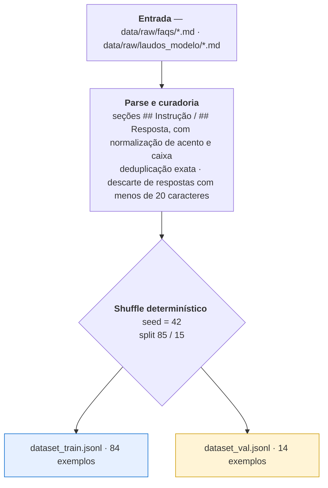
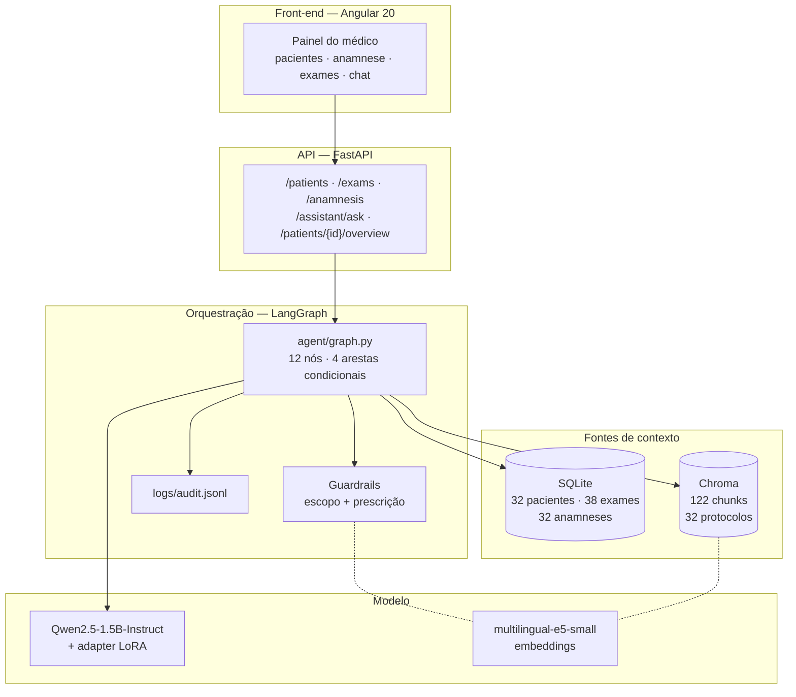
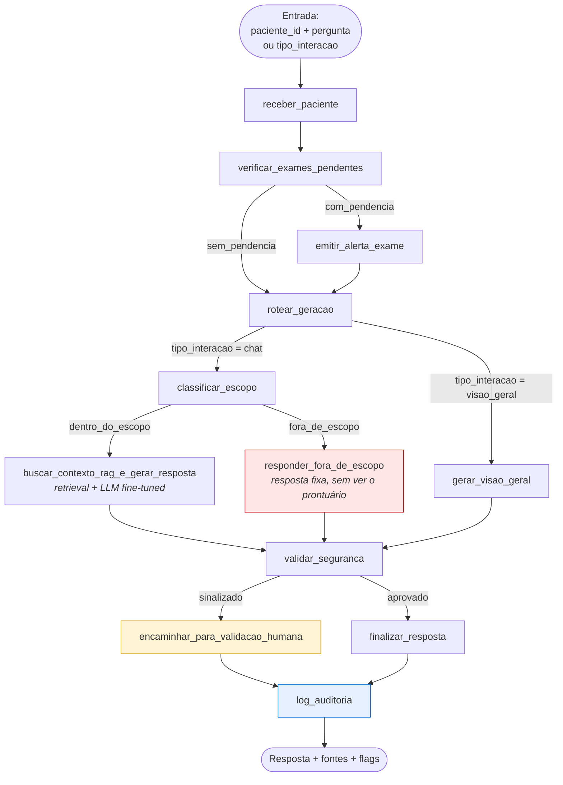
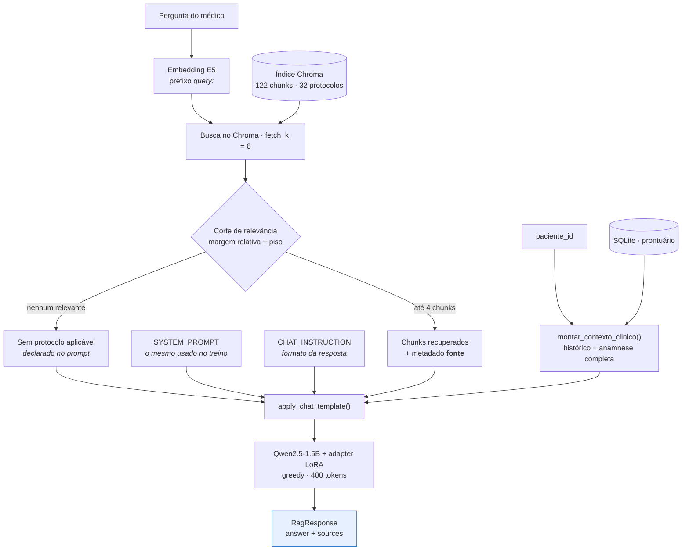
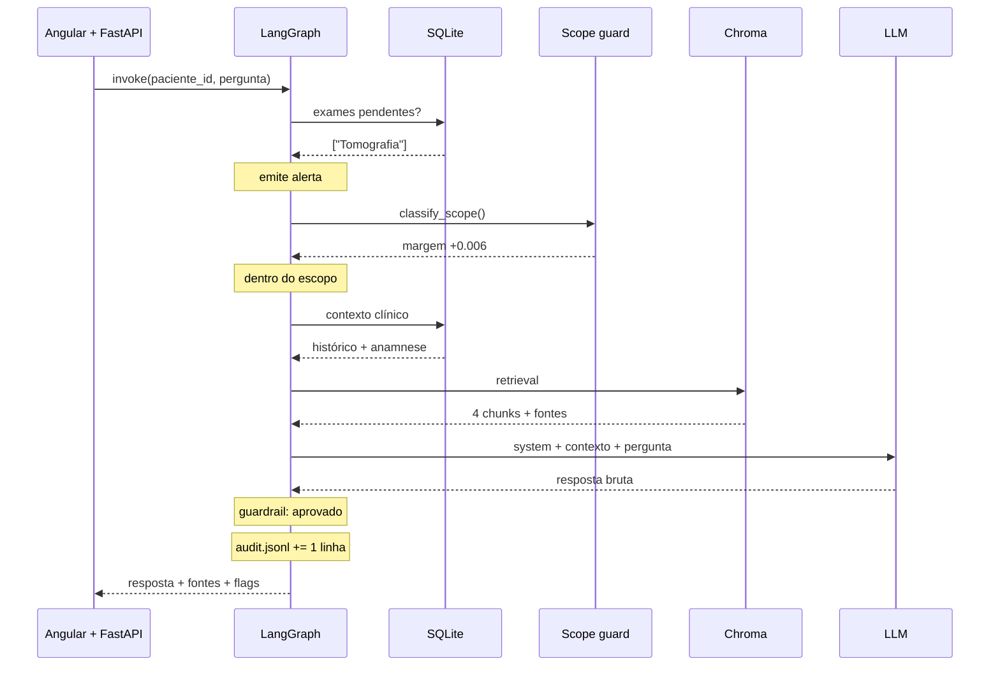

# Relatório Técnico — OncoTech: Assistente Médico Virtual

**Tech Challenge — Fase 3 · Pós-graduação em Inteligência Artificial (FIAP)**
Repositório: `AI-TechChallenge-Step3`

---

## Sumário

1. [Visão geral do sistema](#1-visão-geral-do-sistema)
2. [Processo de fine-tuning](#2-processo-de-fine-tuning)
3. [Descrição do assistente médico](#3-descrição-do-assistente-médico)
4. [Diagrama do fluxo LangChain / LangGraph](#4-diagrama-do-fluxo-langchain--langgraph)
5. [Avaliação do modelo e análise dos resultados](#5-avaliação-do-modelo-e-análise-dos-resultados)
6. [Referências e licenças](#6-referências-e-licenças)

---

## 1. Visão geral do sistema

O sistema é um **assistente médico virtual de apoio à decisão clínica** que atende **todas as especialidades** de um hospital fictício — o "Hospital Vida Nova", cujo painel médico é apresentado sob a marca "Hospital VEinstein". Ele não substitui o julgamento clínico: organiza informação do prontuário, recupera protocolos internos e redige respostas que precisam ser validadas por um profissional habilitado.

O escopo é hospitalar geral, e as três camadas de dados acompanham esse escopo. O prontuário eletrônico simulado, a base de protocolos indexada no RAG e o corpus de fine-tuning cobrem clínica médica, urgência, ortopedia, pneumologia, cardiologia, endocrinologia, gastroenterologia, urologia, neurologia, otorrinolaringologia, oftalmologia, dermatologia, infectologia, cirurgia geral, ginecologia e oncologia, além de temas transversais de segurança do paciente. O assistente é acionado da mesma forma para qualquer um desses casos.

A arquitetura combina três técnicas com papéis distintos:

| Técnica | Papel | Por que é necessária |
|---|---|---|
| **Fine-tuning (QLoRA)** | Estilo, tom clínico, formato de resposta e vocabulário institucional | O modelo base responde com tom de enciclopédia geral; o alvo é o registro clínico do hospital |
| **RAG (LangChain + Chroma)** | Conhecimento factual **citável** — os protocolos internos | Garante rastreabilidade: cada resposta indica de qual protocolo veio a informação |
| **Tools sobre banco estruturado** | Dado do paciente **em tempo real** — histórico, anamnese, exames | Esse dado muda a cada consulta e não pode estar congelado nos pesos do modelo |

A orquestração é feita por um **grafo de estados em LangGraph**, que escolhe o caminho de execução conforme o tipo de interação e o resultado dos guardrails, e registra cada interação em um log de auditoria.

**Números do sistema:**

| Item | Valor |
|---|---|
| Modelo base | `Qwen/Qwen2.5-1.5B-Instruct` (Apache 2.0) |
| Técnica de fine-tuning | QLoRA 4-bit (NF4) + LoRA r=16 |
| Parâmetros treináveis | ≈ 4,36 M (0,28% do total) |
| Dataset de fine-tuning | 98 exemplos (84 treino / 14 validação) |
| Base de conhecimento (RAG) | 32 protocolos → 122 chunks no Chroma |
| Prontuário simulado | 32 pacientes · 30 quadros clínicos distintos · 38 exames · 32 anamneses |
| Grafo LangGraph | 12 nós, 4 arestas condicionais |
| Endpoints da API | 8 |
| Testes automatizados | 86 |

---

## 2. Processo de fine-tuning

### 2.1 Papel do fine-tuning na arquitetura

O que se ajusta no modelo é **comportamento**, não conhecimento. Um modelo de 1,5 bilhão de parâmetros responde perguntas médicas em português com tom de enciclopédia geral e formatação de chatbot. O comportamento-alvo é uma resposta curta, em registro clínico, que enquadre qualquer conduta como sugestão sujeita à validação de um médico responsável e que cite o protocolo em que se apoia.

Esse tipo de ajuste — formato e tom, com pouco conteúdo novo — é o caso em que LoRA/QLoRA com poucas dezenas de exemplos é eficaz, e que o RAG não resolve: o RAG muda o que o modelo *sabe*, não como ele *escreve*.

### 2.2 Dataset

O dataset de fine-tuning é montado a partir de duas pastas em `data/raw/`. Uma terceira pasta, `protocolos/`, alimenta exclusivamente o RAG e não participa do treino:

| Fonte | Arquivos | Papel | Origem |
|---|---:|---|---|
| `faqs/` | 93 | Pares instrução→resposta clínica | 43 sintéticas internas (prefixo `hvn_`) + 50 derivadas de **MedQuAD** (NIH) e **PubMedQA** |
| `laudos_modelo/` | 5 | Formato e tom de documentos: laudo, parecer, encaminhamento, orientação pós-procedimento | Sintético, escrito para o hospital fictício |
| `protocolos/` | 32 | **Fora do fine-tuning** — base de conhecimento do RAG | Sintético |

A separação entre o material de fine-tuning e o material de RAG é estrutural: protocolo é *conhecimento a consultar e citar*. Treinar o modelo diretamente nos protocolos destruiria a rastreabilidade — ele passaria a "saber" o protocolo sem conseguir apontar a origem da informação, que é o requisito de explainability do desafio.

**Composição das 93 FAQs por origem**, identificável pelo prefixo do nome do arquivo:

| Prefixo | Origem | Arquivos | Cobertura |
|---|---|---:|---|
| `hvn_` | Sintético, interno ao hospital fictício | 43 | Todas as especialidades |
| `cancergov_` | MedQuAD / CancerGov | 17 | Oncologia mamária |
| `pubmedqa_` | PubMedQA | 15 | Oncologia mamária |
| `seniorhealth_` | MedQuAD / SeniorHealth | 8 | Oncologia mamária |
| `gard_` | MedQuAD / GARD | 5 | Oncologia mamária |
| `ghr_` | MedQuAD / Genetics Home Reference | 3 | Oncologia mamária |
| `mplustopics_` | MedQuAD / MedlinePlus Health Topics | 2 | Oncologia mamária |

As 43 FAQs internas cobrem os quadros efetivamente presentes no prontuário simulado — hipertensão, diabetes, anemia, disfunção tireoidiana, dor crônica, dor abdominal aguda, cólica renal, trauma de extremidade, trombose venosa profunda, pneumonia, asma, tosse aguda, síndromes febris, infecção urinária, gastroenterite, refluxo, cefaleia, lombalgia, otite, sinusite, conjuntivite, dermatite e hérnia inguinal — mais temas transversais de segurança: registro de alergias, interações medicamentosas, polifarmácia, sinais vitais de alerta, exames pendentes e uso racional de antimicrobianos. Cada uma referencia o protocolo interno correspondente, para que o modelo aprenda a citar a fonte institucional na resposta.

Nenhuma FAQ interna contém posologia específica. A conduta é sempre descrita em nível de orientação e classe terapêutica, coerente com o papel do assistente e com o guardrail de prescrição que verifica a saída — treinar o modelo com texto que o próprio sistema sinalizaria seria incoerente.

As 50 FAQs derivadas de bases públicas cobrem oncologia mamária. O PubMedQA tem formato original de *pergunta de pesquisa + abstract + conclusão sim/não/talvez*, incompatível com um par instrução→resposta clínica; cada item foi reescrito como pergunta e resposta em prosa, preservando a conclusão do estudo. A tradução e o resumo para PT-BR foram feitos com apoio de LLM, sem revisão por profissional de saúde — esse conteúdo é material de estudo, não fonte validada para uso clínico.

**Anonimização.** Não há dado real de paciente em nenhuma etapa. MedQuAD e PubMedQA são bases públicas de conhecimento médico, sem informação identificável. O prontuário simulado é integralmente gerado, com nomes explicitamente fictícios ("Paciente Fictício A" … "Paciente Fictício AF"). A anonimização é estrutural: não existe dado sensível a anonimizar.

### 2.3 Preprocessing e curadoria

`finetuning/prepare_dataset.py` transforma os arquivos Markdown em JSONL no formato Alpaca (`instruction` / `input` / `output`):



Características da implementação:

- **Cabeçalhos tolerantes.** O parser aceita `## Instrução`, `## Pergunta` ou `## Contexto` para a entrada, e `## Resposta`, `## Laudo`, `## Receita`, `## Parecer` ou `## Encaminhamento` para a saída, normalizando acento e caixa. A fonte dos dados pode ser trocada sem alterar o código.
- **Split determinístico** (`RANDOM_STATE = 42`): o conjunto de validação é sempre o mesmo, o que torna as métricas da seção 5 comparáveis entre execuções.
- **Filtro de comprimento mínimo** (20 caracteres na resposta): descarta respostas truncadas na conversão, que ensinariam o modelo a parar cedo.

**Perfil do dataset resultante:**

| Métrica | Valor |
|---|---|
| Exemplos totais | 98 (84 treino / 14 validação) |
| Palavras por instrução | média 13,7 · mín. 6 · máx. 22 |
| Palavras por resposta | média 96,4 · mín. 63 · máx. 138 |
| Volume total de resposta | ≈ 9.400 palavras |

### 2.4 Configuração do treino

**Modelo base: `Qwen/Qwen2.5-1.5B-Instruct`.** A escolha atende a três restrições simultâneas: licença Apache 2.0 sem gate de acesso, suporte multilíngue real a PT-BR, e capacidade de rodar em QLoRA 4-bit na GPU T4 do Colab gratuito.

**QLoRA** — o modelo base é quantizado em 4 bits (NF4, com dupla quantização) e congelado; apenas os adaptadores de baixo posto (LoRA) recebem gradiente.

| Hiperparâmetro | Valor | Justificativa |
|---|---|---|
| `LORA_R` | 16 | Posto suficiente para ajuste de estilo; valores maiores aumentam o risco de overfit num dataset desta ordem |
| `LORA_ALPHA` | 32 | Razão α/r = 2 |
| `LORA_DROPOUT` | 0.05 | Regularização leve, apropriada ao dataset pequeno |
| `LORA_TARGET_MODULES` | `q_proj`, `k_proj`, `v_proj`, `o_proj` | Apenas as projeções de atenção; incluir as camadas MLP aumentaria os parâmetros treináveis sem ganho claro para ajuste de tom |
| `LOAD_IN_4BIT` | `True` (NF4 + double quant) | Reduz a memória do modelo base o suficiente para caber na T4 |
| `NUM_TRAIN_EPOCHS` | 3 | Com 84 exemplos, mais épocas memorizam o conjunto |
| Batch efetivo | 8 (2 × 4 de acumulação) | Batch real de 2 cabe na VRAM da T4; a acumulação recupera a estabilidade do gradiente |
| `LEARNING_RATE` | 2e-4 | Padrão para LoRA, bem acima do usado em fine-tuning completo |
| `MAX_SEQ_LENGTH` | 1024 | Acomoda o maior exemplo (system prompt + instrução + resposta) |

**Volume de treino:** 84 exemplos ÷ batch efetivo 8 = 11 passos por época × 3 épocas = **33 passos de otimização**.

**Parâmetros treináveis:** com r=16 sobre as quatro projeções de atenção, em 28 camadas de um modelo com `hidden_size=1536` e atenção agrupada (12 cabeças de consulta, 2 de chave/valor), o total é ≈ **4,36 milhões de parâmetros**, ou **0,28%** dos ≈ 1,54 bilhão do modelo. O arquivo `adapter_model.safetensors` de 17,4 MB confirma a ordem de grandeza (4,36 M × 4 bytes ≈ 17,4 MB).

**Formatação do prompt.** `SYSTEM_PROMPT` está definido em um único lugar (`finetuning/config.py`) e é usado tanto no treino (`train_qlora.py::build_prompt`) quanto na inferência (`rag/chain.py::ask` e `ask_overview`), sempre através do `apply_chat_template` do tokenizer. Treino e runtime usam exatamente o mesmo template — condição para que o adapter se comporte em produção como se comportou no treino.

O conteúdo do system prompt descreve os mesmos limites que o guardrail de runtime (`agent/guardrails.py`) verifica: o modelo é treinado para respeitar a regra que o sistema fiscaliza. A coerência vai até o dataset — nenhum dos 98 exemplos de treino dispara o filtro de prescrição.

### 2.5 Execução e artefato

O treino roda na **GPU T4 gratuita do Google Colab** (`finetuning/train_qlora_colab.ipynb`), com o adapter salvo no Google Drive a cada época. Stack: `transformers` + `peft` 0.20 + `trl` 1.12 (`SFTTrainer`) + `bitsandbytes` + `accelerate`.

`finetuning/train_qlora.py` também roda **localmente sem GPU**: detecta a ausência de CUDA e carrega o modelo sem quantização em bfloat16 (LoRA, não QLoRA — `bitsandbytes` 4-bit exige CUDA), habilitando *gradient checkpointing* para compensar a memória. O dtype de computação em GPU é resolvido automaticamente: bfloat16 em Ampere ou superior, float16 na T4, que não suporta bf16 nativamente.

**Artefato final:** `finetuning/adapters/cancer-assistant-lora/` — adapter LoRA de 17,4 MB, tokenizer e chat template. O modelo base não é redistribuído; é baixado do Hugging Face na primeira execução.

---

## 3. Descrição do assistente médico

### 3.1 Modos de operação

O assistente vive dentro do painel do médico (Angular 20) e opera em **dois modos**, com caminhos distintos no grafo:

**Visão geral automática.** Ao abrir a ficha de um paciente, o front-end chama `POST /patients/{id}/overview`. O assistente lê o histórico, a anamnese completa e os exames, e devolve duas listas estruturadas: **pontos relevantes** (síntese do caso) e **pontos de atenção** (riscos, exames pendentes, alergias, interações medicamentosas, divergências entre histórico e conduta). O médico vê isso como um card ao lado da ficha, sem precisar perguntar nada.

**Chat.** O médico faz uma pergunta livre sobre o paciente em consulta (`POST /assistant/ask`). A resposta é ancorada nos protocolos internos recuperados via RAG e traz a lista de protocolos consultados.

Nos dois modos, exames pendentes geram um alerta emitido antes da geração, que acompanha a resposta.

Os dois modos são caminhos separados porque a tarefa é diferente. O chat responde a uma pergunta e precisa de retrieval; a visão geral sintetiza um caso e usa um prompt de saída estruturada, com marcadores fixos `RELEVANTE:` e `ATENCAO:` que o backend converte em duas listas. Os nós comuns — checagem de exames, guardrails, validação humana e auditoria — são compartilhados pelos dois caminhos.

### 3.2 Componentes



| Componente | Tecnologia | Papel |
|---|---|---|
| Orquestração | LangGraph | Grafo de estados; garante que todo caminho passe por guardrail e auditoria |
| Geração | `transformers` + `peft`, via `HuggingFacePipeline` | Modelo base + adapter LoRA, servido em processo |
| Recuperação | LangChain + Chroma | 122 chunks (500 caracteres, overlap 50) dos 32 protocolos, com metadado `fonte` |
| Embeddings | `intfloat/multilingual-e5-small` | Usado no RAG e no guardrail de escopo |
| Prontuário | SQLite | Tabelas `pacientes`, `exames`, `anamnese`; seed idempotente |
| API | FastAPI + Pydantic | Grafo carregado uma vez no `lifespan`, não por requisição |
| Front-end | Angular 20 (standalone + Signals) + Material | Painel do médico |

A família `intfloat/multilingual-e5-*` exige os prefixos `passage:` para documentos e `query:` para buscas. Isso está encapsulado em uma subclasse (`rag/embeddings.py::E5Embeddings`) usada tanto na ingestão quanto na busca — se apenas um dos lados aplicasse o prefixo, a qualidade de recuperação cairia sem gerar erro.

### 3.3 Prontuário eletrônico simulado

Sem acesso a sistema hospitalar real, o prontuário é um SQLite consultado como tool do agente, não embutido no prompt. São **32 pacientes cobrindo 30 quadros clínicos distintos**, cada um com anamnese completa e exames coerentes com o diagnóstico:

| Área | Quadros representados |
|---|---|
| Clínica médica | Hipertensão descompensada, diabetes tipo 2 descompensado, hipotireoidismo, anemia ferropriva, fibromialgia |
| Urgência | Apendicite aguda, cólica renal por litíase ureteral, fratura de rádio distal, suspeita de trombose venosa profunda |
| Pneumologia | Pneumonia adquirida na comunidade, bronquite aguda, crise asmática |
| Infectologia | Síndrome gripal, COVID-19, dengue, infecção do trato urinário, sinusite bacteriana |
| Gastroenterologia | Gastroenterite aguda, doença do refluxo gastroesofágico |
| Cirurgia geral | Hérnia inguinal não complicada |
| Neurologia | Enxaqueca crônica, lombociatalgia com suspeita de hérnia de disco |
| Otorrinolaringologia / Oftalmologia | Otite média aguda, conjuntivite bacteriana |
| Dermatologia | Dermatite de contato alérgica |
| Ginecologia / Oncologia | Nódulo mamário em investigação, cisto mamário benigno, carcinoma ductal invasivo em tratamento |
| Rotina | Paciente hígido, rastreamento ginecológico/mamário |

**Schema:**

- `pacientes` — id, nome fictício, histórico, sexo, data de nascimento. A idade não é coluna: é calculada a partir da data de nascimento a cada consulta, para não desatualizar.
- `exames` — id, paciente, tipo, status (`pendente` / `concluido`), datas de solicitação e realização, resultado, médico solicitante, observações.
- `anamnese` — um registro por paciente: queixa principal, história da doença atual, história patológica pregressa, história familiar, história ginecológica/obstétrica, medicamentos em uso, alergias, cirurgias prévias, hábitos, sinais vitais, peso e altura, exame físico, hipótese diagnóstica e conduta.

O seed é idempotente por id (`INSERT OR IGNORE`): reiniciar a API preenche apenas o que falta, sem duplicar nem sobrescrever, e migra bancos criados por versões anteriores do schema.

**Contexto enviado ao modelo.** `montar_contexto_clinico` monta o bloco que vai ao prompt, e ele **abre com idade e sexo**. São os dois dados que mais condicionam conduta: para um mesmo diagnóstico, a apresentação, a investigação e o procedimento indicado mudam completamente entre uma criança e um idoso. Um modelo que não recebe a idade preenche a lacuna com a faixa etária mais frequente na literatura do diagnóstico, e produz conduta correta para o diagnóstico e errada para o paciente — ver [seção 5.6](#56-fidelidade-ao-contexto). Em seguida vêm o histórico resumido, os campos da anamnese e os sinais vitais em linha condensada.

### 3.4 Base de protocolos internos

A base de conhecimento consultada pelo RAG são **32 protocolos** clínicos sintéticos do hospital fictício, indexados por `rag/ingest.py`. Eles cobrem as mesmas áreas presentes no prontuário, mais temas transversais de segurança do paciente:

| Código | Área | Conteúdo |
|---|---|---|
| `MAMA-01`, `MAMA-02`, `ONCO-01`, `ONCO-03` | Oncologia mamária | Rastreamento, conduta por BI-RADS, encaminhamento, segurança em quimioterapia |
| `CLI-01` … `CLI-05` | Clínica médica | Hipertensão, diabetes tipo 2, anemia, disfunção tireoidiana, dor crônica generalizada |
| `URG-01` … `URG-04` | Urgência | Dor abdominal aguda, cólica renal, trauma de extremidade, suspeita de trombose venosa profunda |
| `PNE-01` … `PNE-03` | Pneumologia | Pneumonia adquirida na comunidade, asma, tosse aguda |
| `INF-01` … `INF-03` | Infectologia | Triagem de síndromes febris, infecção urinária, uso racional de antimicrobianos |
| `GAS-01`, `GAS-02` | Gastroenterologia | Gastroenterite e hidratação, doença do refluxo |
| `NEU-01`, `NEU-02` | Neurologia | Cefaleia, lombalgia e lombociatalgia |
| `OTO-01`, `OFT-01`, `DER-01` | Otorrino, oftalmologia, dermatologia | Otite e sinusite, olho vermelho, dermatite de contato |
| `CIR-01` | Cirurgia geral | Hérnia inguinal e avaliação cirúrgica eletiva |
| `SEG-01` … `SEG-04` | Segurança do paciente | Alergias e interações, sinais vitais de alerta, exames pendentes, contraste em exames de imagem |
| `ADM-01` | Rotina | Consulta de check-up e rastreamento |

Cada protocolo é estruturado em torno dos pontos que mudam a conduta: critérios diagnósticos, sinais de alarme que exigem escalonamento, e a ressalva explícita de que a decisão final é do médico responsável. Vários protocolos referenciam outros pelo código, o que dá ao retriever mais de um caminho até a informação pertinente.

Nenhum protocolo contém posologia específica — o assistente é de apoio à decisão e não prescreve.

**Reindexação.** `rag/ingest.py` reconstrói o índice do zero a cada execução (`reset_vectorstore`). Isso é necessário porque `Chroma.from_documents` sobre um `persist_directory` existente **acrescenta** documentos à coleção em vez de substituí-los. Sem o reset, cada execução da ingestão duplica todos os chunks, e o efeito na recuperação é silencioso e grave — ver [seção 5.4](#54-qualidade-da-recuperação-rag).

### 3.5 API

| Método | Rota | Descrição |
|---|---|---|
| `GET` | `/` | Raiz — confirma que a API está no ar e aponta para `/docs` |
| `GET` | `/health` | Status da API e se o grafo foi carregado |
| `GET` | `/patients` | Lista pacientes, com sexo, data de nascimento e idade; `?nome=` filtra por parte do nome |
| `GET` | `/patients/{id}/exams` | Exames do paciente com status e datas |
| `GET` | `/exams/{id}` | Detalhe completo de um exame |
| `GET` | `/patients/{id}/anamnesis` | Ficha de anamnese completa |
| `POST` | `/assistant/ask` | Pergunta livre do médico → resposta + fontes citadas, `termos_etarios_incoerentes` e `citacoes_invalidas` |
| `POST` | `/patients/{id}/overview` | Visão geral automática → `pontos_relevantes` / `pontos_atencao` |

**Convenção de erros:** `503` quando falta um artefato de que o assistente depende (índice do RAG ou adapter fine-tuned), `404` para paciente ou exame inexistente, `500` para o restante.

### 3.6 Segurança, guardrails e explainability

Oito camadas cobrem os requisitos de limite de atuação, logging e explainability:

**1. System prompt compartilhado.** Um único texto em `finetuning/config.py`, usado no treino e no runtime, com três regras: usar o contexto fornecido; declarar explicitamente quando o contexto for insuficiente; **nunca prescrever diretamente** — sempre enquadrar como recomendação a ser validada por médico responsável.

**2. Guardrail de escopo** (`agent/scope_guard.py`) — camada anterior à geração, aplicada ao caminho do chat. Classifica a pergunta por similaridade de embeddings **antes** de montar o contexto do paciente. A classificação é **relativa**: a pergunta é comparada contra um conjunto de âncoras do domínio clínico e contra um conjunto de âncoras fora do domínio (viagem, veículos, esporte, clima, culinária, finanças), e só é aceita quando a similaridade com o lado clínico supera a do lado fora de escopo por uma margem mínima (`SCOPE_MARGIN`).

A comparação é relativa, e não contra um limiar absoluto, porque o `multilingual-e5-small` produz similaridade alta entre quaisquer duas frases curtas em português apenas pela forma interrogativa e pelo registro formal. Comparar os dois lados cancela esse piso comum e isola o sinal de tópico. Perguntas fora do escopo são desviadas para uma resposta fixa em código, que **nunca chega a ver o prontuário** — o que impede o modelo de misturar dado clínico em uma recusa.

**3. Guardrail de prescrição** (`agent/guardrails.py`) — filtro de expressões regulares aplicado a **toda** resposta, em todos os caminhos, procurando linguagem de prescrição direta (`prescrevo`, `receito`, `tome … mg`, `administre … dose`). A resposta nunca é descartada em silêncio: se algum padrão dispara, ela é marcada com `requer_validacao_humana=True` e recebe um aviso anexado. O médico vê o rascunho, sinalizado.

A opção por regex, e não por classificador de ML, é deliberada: em contexto clínico, um filtro simples e auditável é mais defensável que uma caixa-preta sem explicação. Ele é conservador por construção, preferindo falso-positivo a falso-negativo.

**4. Checagem de coerência etária** (`agent/demographic_guard.py`) — aplicada a toda resposta, procurando termos de faixa etária (`recém-nascido`, `lactente`, `criança`, `pediátrico`, `adolescente`, `idoso`, `geriátrico`) cujo intervalo de idade não contenha a idade do paciente.

A regra não é "mencionou uma faixa que não é a do paciente", e sim "mencionou faixas etárias e **nenhuma** delas contém a idade do paciente". A distinção importa: uma resposta que diz *"diferente do que ocorre em crianças, no idoso a conduta é…"* cita uma faixa incompatível, mas demonstra estar orientada pela idade certa ao citar também a compatível. O erro que se quer pegar é a resposta inteiramente ancorada na faixa errada — e essa não tem nenhum termo compatível. Sinalizar as duas produziria alarme em resposta correta, e um guardrail que dispara em resposta boa deixa de ser lido.

Como o guardrail de prescrição, esta camada **não bloqueia nem reescreve**: marca `requer_validacao_humana=True` e anexa a ressalva. Os termos que dispararam vão para o log de auditoria e para a resposta da API, de forma que o revisor sabe exatamente o que procurar no texto.

**5. Verificação de citações** (`agent/citation_guard.py`) — aplicada ao caminho do chat, confere se os protocolos citados na resposta estão entre os efetivamente recuperados para aquela pergunta. Extrai da resposta as referências no formato `protocolo <código>` e compara com os códigos derivados dos nomes de arquivo das fontes (`protocolo_cir01_hernia_inguinal` → `CIR-01`).

A citação é o que dá autoridade institucional a uma afirmação. Uma resposta que atribui a um protocolo interno uma orientação que ele não contém é pior do que uma resposta sem citação alguma: o médico só descobriria abrindo o protocolo. A checagem cobre tanto o código inexistente quanto o código real que não foi consultado — em ambos os casos, o modelo não poderia ter lido o que afirma citar.

O que ela não cobre: uma citação a protocolo de fato recuperado, mas cujo conteúdo a resposta descreve errado. Verificar isso exigiria comparar a afirmação com o texto do protocolo, tarefa semântica fora do alcance de uma checagem léxica. Não citar protocolo nenhum nunca é sinalizado — é legítimo quando não há protocolo aplicável.

**6. Filtro de ancoragem da visão geral** (`agent/overview_filter.py`) — última camada antes de os pontos gerados chegarem ao médico, aplicada só ao caminho da visão geral. Enquanto o parser resolve a **forma** da resposta, este filtro resolve o **conteúdo**: um ponto só é exibido se for rastreável ao prontuário deste paciente, isto é, se compartilhar ao menos um termo de conteúdo com a ficha clínica. A comparação é feita por radical de cinco caracteres, sem acento e sem caixa, para tolerar flexão sem depender de um lematizador.

O filtro também impõe em código o teto de 5 itens por bloco que o prompt pede, colapsa famílias morfológicas (três ou mais itens começando pelo mesmo radical viram um), e classifica a geração como **degenerada** quando o volume de itens excede largamente o pedido ou quando a proporção de itens ancorados é muito baixa. Numa geração degenerada o bloco inteiro é descartado, e não apenas os itens sem âncora: uma lista parcial extraída de uma geração degenerada não é confiável, porque os poucos itens ancorados podem ter casado por coincidência lexical e o médico não tem como saber de que regime de geração cada item veio.

A contrapartida é assumida: a regra descarta também inferência clínica legítima que use vocabulário ausente da ficha. Num apoio à decisão clínica, exibir um achado fabricado custa mais do que omitir um achado correto que o médico obtém lendo a própria ficha e o protocolo. O número de itens descartados e o sinalizador de degeneração vão para o log de auditoria e para a resposta da API, o que torna esse custo mensurável em vez de invisível.

**7. Nó de validação humana.** Respostas sinalizadas passam por um nó dedicado que marca `status="aguardando_validacao_humana"`. O fluxo não é interrompido — a decisão sobre um rascunho sinalizado é do médico, não do sistema.

**8. Explainability em duas frentes.** Toda resposta de chat cita os protocolos recuperados: o metadado `fonte` é preservado desde a leitura do arquivo, antes do chunking, e retorna no campo `fontes` da API. E o log de auditoria (`logs/audit.jsonl`) grava **24 campos por interação**: timestamp, tipo de interação, paciente e idade, pergunta, decisão e as três similaridades do guardrail de escopo, exames pendentes, alerta, fontes citadas e as similaridades dos chunks aceitos, resposta bruta, resposta final, pontos estruturados da visão geral e quantos foram descartados, padrões de prescrição sinalizados, termos etários incoerentes, citações inválidas, sinalizador de geração degenerada e status.

Registrar a resposta **bruta** ao lado da final é o que torna cada camada auditável depois do fato: é possível reconstruir o que o modelo produziu, o que cada guardrail alterou e por quê — foi assim que os casos analisados na seção 5 foram diagnosticados. Uma linha JSON por interação, em modo *append*; falha de escrita do log nunca derruba uma resposta já gerada.

---

## 4. Diagrama do fluxo LangChain / LangGraph

### 4.1 Grafo de decisão (LangGraph)



**Arestas condicionais:**

| Aresta | Decisão baseada em | Caminhos |
|---|---|---|
| `verificar_exames_pendentes` | Consulta ao SQLite | `com_pendencia` → emite alerta · `sem_pendencia` → segue |
| `rotear_geracao` | Campo `tipo_interacao` do estado | `chat` → classificação de escopo · `visao_geral` → geração direta |
| `classificar_escopo` | Similaridade relativa de embeddings | `dentro_do_escopo` → RAG + geração · `fora_de_escopo` → resposta fixa |
| `validar_seguranca` | Resultado do filtro de prescrição | `sinalizado` → validação humana · `aprovado` → finaliza |

Três propriedades que o desenho garante:

1. **`log_auditoria` é terminal e sempre executado.** Não existe caminho de saída que não passe por ele — nem o de recusa por escopo, nem o de resposta sinalizada.
2. **`validar_seguranca` é ponto de convergência obrigatório.** Os três nós de geração (RAG, visão geral, recusa) convergem nele. Nenhuma resposta escapa do guardrail.
3. **`rotear_geracao` é um nó de passagem, sem efeito no estado.** Existe para dar um ponto único de saída aos dois caminhos anteriores (com e sem exame pendente), evitando duplicar a aresta condicional de tipo de interação.

### 4.2 Chain de recuperação e geração (LangChain)



Duas características da implementação:

- **A chain não é uma única `Runnable` LCEL encadeada.** É montada como um dicionário de componentes (`retriever`, `llm_chat`, `llm_overview`, `tokenizer`), porque `ask()` precisa da resposta gerada **e** dos metadados de fonte dos chunks — informação que se perde em uma chain LCEL que devolve apenas a string final. A explainability exigida pelo desafio determina a estrutura da chain.
- **Dois wrappers de pipeline sobre o mesmo modelo.** `llm_chat` (400 tokens) e `llm_overview` (450 tokens) compartilham o mesmo `model` e `tokenizer` carregados: não há peso duplicado em memória, apenas duas configurações de geração. Ambos usam **geração gulosa** (`do_sample=False`), `repetition_penalty=1.15` e `no_repeat_ngram_size=3`. Responder uma pergunta clínica a partir de um prontuário e de um protocolo não é tarefa criativa: a variação entre execuções não produz resposta melhor, atrapalha a auditoria — a mesma pergunta sobre o mesmo paciente deveria dar a mesma resposta — e, num modelo pequeno, é por onde entram palavras coladas e malformadas.

- **Corte de relevância na recuperação** (`rag/relevance.py`). A busca traz 6 candidatos e o corte decide quantos entram no prompt: são aceitos os que estiverem a até 0,05 de similaridade do melhor, limitado a 4. O corte é **relativo** pela mesma razão do guardrail de escopo — o E5 tem piso alto de similaridade entre textos curtos em português, e um limiar fixo ou aprova tudo ou corta tudo conforme o comprimento da pergunta. Como o corte relativo sozinho aprovaria em bloco um conjunto de candidatos igualmente ruins, há também um piso absoluto baixo: se nem o melhor o supera, a lista volta vazia e o prompt declara explicitamente que nenhum protocolo interno trata do assunto.

- **Formato de resposta pedido ao chat** (`CHAT_INSTRUCTION`). Conduta sugerida em uma frase direta, justificativa em até três, citação apenas dos protocolos que se aplicam, proibição de contradizer a ficha do paciente e de sustentar duas condutas incompatíveis, sinais de alerta ao final.

A visão geral usa uma variante desse fluxo, **sem retrieval**: o insumo é o caso do paciente, não os protocolos do hospital.

### 4.3 Sequência ponta a ponta (chat)



---

## 5. Avaliação do modelo e análise dos resultados

A avaliação tem duas frentes: a **comparação quantitativa** entre modelo base e modelo fine-tuned, e a **medição do comportamento do sistema em operação**, a partir das 68 interações registradas no log de auditoria.

As medições de operação relatadas nas seções 5.3 a 5.7 foram obtidas com a base de protocolos e o adapter anteriores à ampliação para as demais especialidades. Elas continuam válidas como caracterização do comportamento das camadas que não mudaram — guardrail de escopo, parsing, auditoria — e como diagnóstico da configuração de recuperação. A [seção 5.9](#59-estado-de-medição) registra o que precisa ser remedido após o re-treino e a reindexação.

### 5.1 Metodologia da comparação base vs. fine-tuned

`finetuning/evaluate.py` gera, para o mesmo conjunto de perguntas, as respostas do **modelo base sem adapter** e do **modelo base + adapter LoRA**, e calcula métricas comparáveis.

**Conjunto de teste:** as 14 perguntas de `dataset_val.jsonl` — o split de validação, nunca usado para atualizar pesos (o `SFTTrainer` o consome apenas como `eval_dataset` para a loss). Por ser sorteado do conjunto completo com semente fixa, cobre tanto perguntas de oncologia mamária quanto das demais especialidades e dos temas transversais de segurança, além dos pedidos de geração de documento.

**Métricas.** Nenhuma delas mede correção clínica — isso exigiria um médico avaliando as respostas, o que está fora do escopo deste trabalho. Elas medem se o fine-tuning aproximou o **comportamento** do modelo do comportamento-alvo:

| Métrica | O que mede | Direção |
|---|---|---|
| `similaridade_referencia` | Cosseno entre o embedding da resposta gerada e o da resposta de referência (mesmo E5 do RAG). Proxy de "tratou do mesmo assunto", não de "acertou" | maior |
| `taxa_guardrail` | Fração de respostas que o filtro de prescrição sinalizaria. Reusa o mesmo `agent/guardrails.py` do runtime | menor |
| `taxa_ressalva` | Fração de respostas que enquadram explicitamente a informação como sujeita a validação profissional | maior |
| `distinct_3` | Proporção de trigramas distintos. Detecta degeneração por repetição | maior |
| `comprimento_palavras` | Média de palavras por resposta. Indica mudança de regime de verbosidade | — |

**Controles metodológicos:**

- **Geração greedy** (`do_sample=False`) em vez da amostragem usada em runtime (`temperature=0.3`), para que a comparação seja reproduzível. Os números daqui não reproduzem exatamente o que a API responde em operação.
- **Sem RAG**, para isolar o efeito do fine-tuning. As respostas da API passam ainda por retrieval e pelo grafo.
- **Mesmo prompt e mesmo chat template** dos dois lados, idênticos aos do treino. Um template divergente mediria a divergência de template, não o efeito do fine-tuning.
- **Modelos carregados em sequência**, não simultaneamente — em CPU, manter os dois na RAM dobraria o consumo.
- O `multilingual-e5-small` tem piso alto de similaridade entre textos em português: o valor absoluto importa menos que a **diferença** entre base e fine-tuned no mesmo item.

```bash
python finetuning/evaluate.py
# → data/processed/evaluation/evaluation.json   (respostas completas + métricas por item)
# → data/processed/evaluation/evaluation.md     (tabela comparativa)
```

### 5.2 Resultados da comparação

| Métrica | Base | Fine-tuned | Δ |
|---|---:|---:|---:|
| Similaridade com a referência | _a preencher_ | _a preencher_ | |
| Taxa de acionamento do guardrail | _a preencher_ | _a preencher_ | |
| Taxa de ressalva de validação | _a preencher_ | _a preencher_ | |
| Trigramas distintos | _a preencher_ | _a preencher_ | |
| Comprimento médio (palavras) | _a preencher_ | _a preencher_ | |

**Hipóteses declaradas antes da execução**, para que o resultado seja interpretável e não retroajustado:

1. A **taxa de ressalva** deve subir no fine-tuned — é o comportamento mais diretamente ensinado pelo system prompt repetido em 84 exemplos de treino.
2. O **comprimento médio** deve cair — as respostas de referência têm 96 palavras em média, bem menos do que o modelo base produz espontaneamente.
3. A **similaridade com a referência** deve subir modestamente. Uma subida grande seria indício de memorização, não de generalização, com um dataset deste tamanho.
4. Os **trigramas distintos** podem cair no fine-tuned: fine-tuning em dataset pequeno aumenta a propensão a repetição.

### 5.3 Guardrail de escopo

Medição sobre perguntas reais submetidas ao chat, com as similaridades registradas no log de auditoria:

| Pergunta | Sim. clínica | Sim. fora | Margem | Decisão |
|---|---:|---:|---:|---|
| "Devo trocar a vela de ignição do meu carro de 12 em 12 meses?" | 0,847 | 0,921 | −0,075 | rejeitada |
| "Qual o melhor dia para comer feijoada?" | 0,823 | 0,859 | −0,036 | rejeitada |
| "Caso eu queira colocar a sétima janela no meu carro, com quem devo falar?" | 0,848 | 0,875 | −0,027 | rejeitada |
| "Qual cor de janela devo colocar em uma casa no campo?" | 0,810 | 0,829 | −0,019 | rejeitada |
| "Devo lavar o olho com água nesse caso?" | 0,848 | 0,841 | +0,006 | aceita |
| "Andar de bicicleta na Antártica tomando um sorvete é uma boa ideia?" | 0,857 | 0,853 | +0,005 | aceita |

**Análise.** As quatro perguntas claramente de outro domínio são rejeitadas, e a pergunta clínica legítima — sobre a conduta em um paciente com conjuntivite — é aceita. Os números absolutos confirmam o piso do modelo de embeddings: todas as similaridades contra as âncoras clínicas ficam entre 0,81 e 0,86, independentemente do assunto. É a comparação relativa que separa as classes.

A última linha expõe o limite da abordagem: uma pergunta absurda porém semanticamente neutra é aceita com margem de +0,005. E a margem da pergunta clínica legítima é +0,006 — da mesma ordem. **As duas classes não estão separadas por uma margem confortável.** Elevar `SCOPE_MARGIN` para eliminar o falso positivo eliminaria também a pergunta clínica válida.

O guardrail, portanto, resolve o caso comum sem folga de decisão. As três similaridades ficam gravadas no log de auditoria, o que permite recalibrar `SCOPE_MARGIN` com volume maior de perguntas clínicas reais — e é, em si, um exemplo de explainability: a decisão de recusa é um número auditável, não uma opinião do modelo.

### 5.4 Qualidade da recuperação (RAG)

Distribuição das fontes citadas nas 35 recuperações registradas:

| Protocolo | Vezes citado |
|---|---:|
| `protocolo_seg04_contraste` | 20 |
| `protocolo_onco03_seguranca_quimioterapia` | 5 |
| `protocolo_mama02_conduta_birads` | 5 |
| `protocolo_mama01_rastreamento` | 4 |
| `protocolo_onco01_encaminhamento` | 0 |

Um único protocolo concentra 57% das citações, inclusive em casos em que é irrelevante: à pergunta "Devo lavar o olho com água nesse caso?", para um paciente com conjuntivite, o sistema citou o protocolo de segurança no uso de contraste iodado.

**Diagnóstico.** O log revela o mecanismo por trás desse número: **29 das 32 interações com recuperação citaram exatamente uma fonte**, apesar de o retriever estar configurado com `top_k=4`. Um retriever que devolve 4 chunks e produz uma única fonte distinta está devolvendo *o mesmo chunk quatro vezes*.

A causa é a semântica de `Chroma.from_documents` sobre um `persist_directory` já existente: ela **acrescenta** os documentos à coleção em vez de substituí-la. Executar `rag/ingest.py` repetidamente multiplica o índice — o índice medido continha 10 chunks por protocolo, cinco vezes os 2 chunks que cada documento efetivamente produz com `chunk_size=500`. Com cinco cópias idênticas de cada trecho, os 4 vizinhos mais próximos de qualquer consulta tendem a ser as próprias cópias do trecho de maior similaridade, e a diversidade da recuperação colapsa para um documento por pergunta.

Isso explica as duas observações de uma vez: a concentração em um único protocolo e a citação de fonte irrelevante — com apenas um documento efetivo por resposta, uma similaridade marginal vence sozinha, sem os outros três trechos para contrabalançar.

**Configuração atual.** `rag/ingest.py` reconstrói o índice do zero a cada execução (`reset_vectorstore`), o que torna a indexação idempotente e elimina a duplicação. A base indexada é de 32 protocolos e 122 chunks, cobrindo as especialidades atendidas pelo hospital.

**Consequência no texto da resposta.** A recuperação irrelevante não fica contida no contexto: ela molda a resposta. Uma pergunta sobre qual procedimento realizar num paciente com hérnia inguinal recebeu chunks de pneumonia e de oncologia mamária, e a resposta passou a percorrer o material recuperado comentando item por item — *"o protocolo X orienta…", "o protocolo Y não especifica…", "os protocolos de pneumonia e mamário também não oferecem detalhes"* — antes de arriscar uma conduta ao final. O modelo tratou o contexto como uma lista a resenhar, não como material para responder.

Dois defeitos se somaram aí. O primeiro é de recuperação, tratado pelo corte de relevância. O segundo é de **prompt**: o caminho do chat não dizia nada sobre a forma da resposta, ao contrário da visão geral, que sempre teve uma instrução de formato. Um modelo pequeno que recebe uma lista rotulada e nenhuma instrução tende a resenhar a lista. `CHAT_INSTRUCTION` (4.2) fecha essa lacuna.

**Limitação que permanece.** O retriever usa um corte de relevância, mas, **sem `similarity_score_threshold`**: ele sempre devolve 4 chunks, existam ou não chunks pertinentes. Com a base ampliada e sem duplicação, os quatro tendem a ser relevantes para os quadros cobertos, mas para uma pergunta fora de todo o acervo o retriever ainda devolverá os quatro menos irrelevantes em vez de lista vazia. O system prompt já instrui o modelo a declarar contexto insuficiente; hoje ele nunca exercita essa instrução, porque sempre recebe contexto.

Há um efeito colateral favorável em toda essa análise: como as fontes são citadas, o problema ficou **visível** e mensurável a partir do log. Um sistema sem explainability teria o mesmo defeito, em silêncio.

### 5.5 Estabilidade da geração e aderência ao formato

A configuração de geração aplica `repetition_penalty=1.15` e `no_repeat_ngram_size=3` nos dois pipelines, tetos de tokens separados por tarefa (400 no chat, 450 na visão geral) e geração gulosa na visão geral. Isso reduz — sem eliminar — dois comportamentos característicos de modelos pequenos: loops de repetição e truncamento no meio da resposta.

Vale registrar o limite dessas defesas. `no_repeat_ngram_size` proíbe repetir a mesma sequência exata de três tokens, e por isso **não contém a deriva morfológica**: quando o modelo produz `fibrose`, `fibrotic`, `fibrilari`, `fibrinoses`, cada item é uma sequência de tokens diferente, e nenhuma restrição de n-grama é violada. O teto de tokens é a contenção que efetivamente limita o volume dessa deriva, e por isso um teto generoso demais é contraproducente: não dá espaço para uma resposta melhor, dá espaço para o modelo continuar gerando depois de já ter dito o que tinha a dizer.

A aderência ao formato de saída pedido à visão geral (`RELEVANTE:` / `ATENCAO:`, itens iniciados por `-`) não é garantida pelo modelo. O parser (`agent/overview_parser.py`) é defensivo por isso:

- **Rótulos tolerantes a variação**: aceita singular e plural, com e sem acento (`RELEVANTES?`, `ATEN[CÇ][AÃ]O(?:ES|S)?`).
- **Três níveis de fallback na extração de itens**: marcadores `-`/`*`; uma linha por item quando não há marcador; enumeração em linha única separada por vírgula ou ponto-e-vírgula.
- **Consolidação de itens redundantes** (`agent/overview_summarizer.py`): quando vários itens compartilham prefixo e sufixo em nível de palavra, são fundidos em um só com as variações separadas por vírgula. A fusão é conservadora e nunca junta achados sem sobreposição textual clara.

O princípio de projeto é tratar o formato como saída não confiável e parseá-la defensivamente, em vez de depender da obediência do modelo ao prompt. Cada regra do parser tem teste de regressão correspondente.

A limitação estrutural do parser é que ele trata **forma**, não **conteúdo**: uma lista de 167 itens bem formatados, com marcadores corretos, atravessa todas as suas regras sem objeção. Essa é a fronteira endereçada pela seção seguinte.

### 5.6 Fidelidade ao contexto

A limitação mais séria do modelo aparece na visão geral, e tem duas manifestações medidas.

**Comorbidade fabricada.** Trecho do bloco de pontos de atenção gerado para um paciente com conjuntivite bacteriana:

> "Hipertensão arterial sistêmica alta (PA 180/100 mmHgg). Não há histórico de diabetes ou colesterol alto. **Há suspeita de reação adversa a antibióticos. Pacientemente é portador de doença autoimune. Paciência tem histórico de problemas cardíacos familiares.** PacIENTE TEM HIPERTENSÃO ARTERIAL SISTÊMICA ALTA E CONSIDERA APOIAR SEUS DADOS CLÍNICOS COM UMA TECNOLOGIA DE COORDENAÇÃO DOS DADOS DO PACIENTE…"

Doença autoimune, histórico familiar cardíaco e suspeita de reação adversa a antibióticos não constam da ficha. Há ainda degeneração morfológica — "Paciente" vira "Pacientemente" e depois "Paciência"; "mmHg" vira "mmHgg" — e a frase final perde sentido em caixa alta.

**Deriva por associação livre.** A manifestação extrema, num paciente com hérnia inguinal não complicada: o bloco de pontos de atenção veio com **167 itens**. A sequência começa em um achado plausível ("Encarceramento" — a complicação real de uma hérnia), passa por comorbidades não registradas na ficha (insuficiência renal crônica, diabetes, edema pulmonar), deriva para famílias inteiras de neoplasias e infecções sem qualquer relação com o caso (`carcinoma epitelial`, `carcinoma laringe`, `meningovascular`, `meningococcemia`) e termina em morfologia inventada: `fibrilari`, `filtracão`, `filtrança`, `filtrapta`, `filtreiras`, `filtramentos`.

O padrão tem três marcas mensuráveis: **volume** muito acima dos 5 itens pedidos, **deriva temática** — nenhum dos 167 itens compartilha um termo de conteúdo com o prontuário — e **famílias morfológicas**, sequências de variações de um mesmo radical.

**Conduta na faixa etária errada.** Uma terceira manifestação, com causa distinta das duas anteriores. À pergunta sobre qual procedimento realizar num paciente de **66 anos** com hérnia inguinal, a resposta descreveu a conduta da hérnia inguinal **pediátrica**.

Aqui o modelo não fabricou: ele preencheu uma lacuna. Idade e sexo não constavam do contexto enviado ao prompt — `montar_contexto_clinico` compunha o bloco a partir do histórico resumido e dos campos da anamnese, e nenhum dos dois carrega esses dados, que vivem na tabela `pacientes`. Sem a idade, o modelo assumiu a faixa etária mais frequente na literatura do diagnóstico, e a hérnia inguinal pediátrica é largamente predominante nessa literatura. O resultado é o tipo de erro mais difícil de perceber numa leitura rápida: internamente coerente, clinicamente bem escrito, e errado para o paciente à frente.

A correção é na origem — o contexto passou a abrir com idade e sexo (3.3) — com a checagem de coerência etária (3.6) como segunda camada, porque a consequência de não perceber esse erro é alta demais para depender de uma única defesa. Aplicada à resposta observada, com a idade real do paciente:

| Entrada | Resultado |
|---|---|
| Resposta citando `criancas`, paciente de 66 anos | `requer_validacao_humana=true`, termo `criancas` reportado, ressalva anexada |
| Mesma resposta, paciente de 4 anos | não sinalizada — a faixa citada contém a idade |
| `"diferente do que ocorre em crianças, no idoso…"`, paciente de 66 anos | não sinalizada — há faixa compatível na resposta |

**Citação falsa.** Uma quarta manifestação, na mesma resposta sobre a hérnia inguinal:

> "**Protocolo seg-01: Hernias inguinais** — orienta-se a realização de uma cirurgia […] **Protocolo pneumo-02**: as recomendações são generalizadas […] parece conveniente realizar uma **cirurgia eletiva emergencial** […] justificado pelos **sinais potenciais de estrangulamento**"

Quatro erros distintos, de naturezas diferentes:

| Trecho | Problema |
|---|---|
| "Protocolo seg-01: Hernias inguinais" | O SEG-01 existe, mas trata de alergias e interações medicamentosas. Hérnia inguinal é o CIR-01 |
| "Protocolo pneumo-02" | Código inexistente — os de pneumologia são PNE-01 a PNE-03 |
| "cirurgia eletiva emergencial" | Contradição em termos; a resposta antes sugerira monitoramento domiciliar |
| "sinais potenciais de estrangulamento" | A ficha diz o oposto: "sem sinais de encarceramento ou irritação peritoneal" |

A verificação de citações (3.6) cobre os dois primeiros. Aplicada a essa resposta, sinaliza `SEG-01` e `PNEUMO-02` como citações não presentes nas fontes consultadas, e marca a resposta para validação humana. A contradição interna e a contradição com a ficha são endereçadas pelo prompt (`CHAT_INSTRUCTION`, regras 4 e 5), não por verificação automática — detectá-las exigiria comparação semântica entre afirmações, o que está fora do alcance das camadas léxicas deste projeto.

**Por que as camadas anteriores não contêm a deriva.** O guardrail de prescrição não sinaliza esse texto, e corretamente: não há linguagem de prescrição nele. O guardrail cobre *prescrição direta*, não *fabricação de fato clínico* — são riscos diferentes. `no_repeat_ngram_size` não se aplica, porque cada item é uma sequência de tokens distinta. `merge_similar_bullets` também não, porque exige prefixo e sufixo comuns em nível de palavra, e itens de uma ou duas palavras não formam template. E o parser não objeta: a lista está bem formatada.

**A camada que endereça isso.** O filtro de ancoragem (`agent/overview_filter.py`, descrito em 3.6) exige que cada item compartilhe um termo de conteúdo com o prontuário do paciente, e descarta o bloco inteiro quando classifica a geração como degenerada. Aplicado à saída de 167 itens acima, com o contexto clínico real do paciente:

| Bloco | Itens gerados | Ancorados no prontuário | Resultado |
|---|---:|---:|---|
| `RELEVANTE` | 2 | 2 | ambos exibidos |
| `ATENCAO` | 167 | 0 | bloco descartado, `geracao_degenerada=true` |

O médico vê os dois pontos relevantes legítimos e nenhum ponto de atenção, em vez de uma lista de 167 termos entre os quais não teria como distinguir o achado real do inventado. A API devolve `pontos_descartados` e `geracao_degenerada` para que a interface possa diferenciar "nada a sinalizar" de "resposta descartada".

**O que permanece.** As quatro manifestações têm em comum a origem — um modelo pequeno ao qual se pede síntese e raciocínio clínico — mas exigiram defesas distintas: dado ausente do prompt se resolve completando o prompt; conteúdo fabricado se resolve exigindo ancoragem; conduta na faixa errada se resolve confrontando a resposta com o dado estruturado; citação falsa se resolve conferindo a referência contra as fontes efetivamente consultadas. Nenhuma delas ataca a geração. O filtro impede a exibição da alucinação; não impede sua produção. A causa é estrutural — um modelo de 1,5 bilhão de parâmetros ajustado com poucas dezenas de exemplos, ao qual se pede síntese analítica sobre um bloco de texto longo. O fine-tuning ensina o formato, não a fidelidade ao contexto. Um item de atenção clinicamente correto mas expresso com vocabulário ausente da ficha também é descartado, o que é uma perda real e assumida: a alternativa é exibir uma lista cuja confiabilidade o leitor não pode avaliar.

### 5.7 Comportamento agregado do sistema

Das 68 interações registradas, sobre 7 pacientes distintos:

| Indicador | Valor | Leitura |
|---|---:|---|
| Interações totais | 68 | 31 visões gerais, 24 chats, 13 anteriores ao registro de tipo |
| Sinalizadas pelo guardrail de prescrição | 0 | Nenhum falso positivo — e nenhum verdadeiro positivo |
| Coerência etária | Camada nova | Sem histórico de operação; validada por teste sobre o caso real |
| Verificação de citações | Camada nova | Idem — sinaliza as duas citações falsas do caso observado |
| Encaminhadas para validação humana | 0 | Consequência direta da linha acima |
| Com alerta de exame pendente | 34 (50%) | O nó de exames está exercitado e funcionando |
| Erros de execução do grafo | 0 | Todas chegaram a `status="concluido"` |

**Sobre o guardrail de prescrição nunca ter disparado:** isso não é evidência de que funciona. É evidência de que o modelo fine-tuned não produziu linguagem de prescrição direta nas perguntas submetidas — comportamento desejado, mas que também significa que o filtro **não foi exercitado em operação**. Sua cobertura real é conhecida apenas pelos testes unitários, e o caminho de validação humana no grafo permanece não exercitado com dado real.

**Cobertura de testes:** 86 testes automatizados, todos passando, sobre lógica pura, sem carregar LLM nem modelo de embeddings — guardrail de escopo (7), consolidação de itens (7), parsing da visão geral (11), filtro de ancoragem (15), coerência etária (15), verificação de citações e corte de relevância (18) e métricas de avaliação (12). Cada caso real observado em operação entra como teste de regressão: a saída degenerada de 167 itens, a resposta pediátrica para paciente de 66 anos, as citações `SEG-01` e `PNEUMO-02`.

### 5.8 Síntese e limitações

| Aspecto | Estado | Evidência |
|---|---|---|
| Pipeline ponta a ponta | ✅ Funcional | 68 interações, 0 erros de execução |
| Fine-tuning | ✅ Pipeline completo e reprodutível | Dataset de 98 exemplos, QLoRA em 33 passos, adapter de 17,4 MB |
| Explainability | ✅ Implementada | Fontes citadas em toda resposta de chat; similaridades numéricas no log |
| Prontuário multiespecialidade | ✅ Implementado | 32 pacientes, 30 quadros clínicos distintos |
| Cobertura da base de conhecimento | ✅ Alinhada ao escopo | 32 protocolos e 43 FAQs internas cobrindo as áreas do prontuário |
| Indexação do RAG | ✅ Idempotente | `reset_vectorstore` elimina a duplicação de chunks |
| Guardrail de escopo | ⚠️ Funciona, sem folga | Margens de +0,005 (falso positivo) vs. +0,006 (caso legítimo) |
| Citação de protocolo | ✅ Verificada | Código inexistente ou não recuperado é sinalizado |
| Forma da resposta do chat | ✅ Especificada | `CHAT_INSTRUCTION` define conduta direta, citação e sinais de alerta |
| Estabilidade da geração | ⚠️ Contida por parsing defensivo | Repetição e desvio de formato tratados no backend |
| Guardrail de prescrição | ⚠️ Não exercitado | 0 acionamentos em 68 interações |
| Exibição de conteúdo fabricado | ✅ Bloqueada | Filtro de ancoragem descarta o bloco degenerado (167 → 0 itens) |
| Dado demográfico no prompt | ✅ Corrigido | Idade e sexo abrem o contexto clínico |
| Conduta em faixa etária errada | ⚠️ Sinalizada, não bloqueada | Checagem de coerência etária marca para validação humana |
| Geração de conteúdo fabricado | ❌ Limitação do modelo | Alucinação ocorre; é contida na exibição, não na origem |
| Comparação base vs. fine-tuned | ⏳ Script pronto, execução pendente | `finetuning/evaluate.py` |

**Limitações:**

1. **Fidelidade ao contexto na visão geral** (5.6) — a mais grave. O filtro de ancoragem impede que conteúdo fabricado seja exibido, mas não impede que seja gerado, e descarta junto a inferência clínica legítima que use vocabulário ausente da ficha.
2. **Dataset desalinhado com uma das tarefas.** Os 98 exemplos são de resposta a pergunta clínica e de geração de documento; nenhum é de síntese de prontuário, que é a tarefa da visão geral.
3. **Volume do dataset.** 98 exemplos são suficientes para ajustar formato e tom, não para incorporar conhecimento clínico novo — o que é coerente com a divisão de papéis da arquitetura, mas limita o que se pode esperar do fine-tuning isoladamente.
4. **Tradução automática sem revisão clínica** das 50 FAQs derivadas de bases públicas.
5. **Protocolos sintéticos.** Os 32 protocolos são material acadêmico escrito para o projeto, não diretrizes institucionais validadas.
6. **Coerência etária apenas lexical.** A checagem cobre termos explícitos de faixa etária. Uma conduta inadequada à idade expressa sem nenhum desses termos passa sem sinalização.
7. **Verificação de citações apenas referencial.** Confere se o protocolo citado foi consultado, não se a resposta descreve corretamente o que ele diz.
8. **Contradição interna não é detectada.** Uma resposta que sustenta duas condutas incompatíveis, ou que contradiz a ficha do paciente, é endereçada só pelo prompt.
9. **Corte de relevância não calibrado.** Margem e piso foram escolhidos por raciocínio sobre o comportamento do E5, não por medição (5.4).
10. **Guardrail de escopo sem folga de decisão** (5.3).
11. **Guardrail de prescrição não exercitado em operação** (5.7).
12. **Avaliação sem julgamento clínico.** Nenhuma métrica deste trabalho mede correção médica.
13. **Sem persistência de estado entre interações.** Não há memória de conversa.
14. **Modelo servido em processo.** `HuggingFacePipeline` dentro do FastAPI: adequado ao escopo acadêmico, não a produção.

**Ações indicadas, por prioridade:**

| # | Ação | Justificativa |
|---|---|---|
| 1 | Calibrar margem e piso do corte de relevância com as similaridades do log | Os valores atuais não foram medidos (5.4) |
| 2 | Ampliar o dataset com exemplos de síntese de prontuário | A tarefa da visão geral não tem representação no treino, o que é a raiz da deriva descrita em 5.6 |
| 3 | Calibrar o filtro de ancoragem com dado de operação | Medir quantos itens legítimos estão sendo descartados junto com os fabricados |
| 4 | Recalibrar `SCOPE_MARGIN` com volume de perguntas clínicas reais | Requer dado de operação ainda não disponível |
| 5 | Testar Qwen2.5-3B ou 7B | Ataca a alucinação na origem, e não apenas na exibição |
| 6 | Servir o modelo fora do processo (merge + GGUF + Ollama, ou vLLM) | Desacopla API e inferência |

### 5.9 Estado de medição

O dataset e a base de protocolos foram ampliados para cobrir todas as especialidades do hospital. Isso torna necessária a regeneração dos dois artefatos derivados antes que as métricas sejam refeitas:

```bash
python rag/ingest.py                          # reindexa os 32 protocolos → 122 chunks
python finetuning/train_qlora.py              # ou o notebook Colab: re-treina com os 84 exemplos
python finetuning/evaluate.py                 # preenche a tabela de 5.2
```

| Medição | Situação |
|---|---|
| Comparação base vs. fine-tuned (5.2) | Pendente da execução de `evaluate.py` sobre o adapter re-treinado |
| Guardrail de escopo (5.3) | Válida — `agent/scope_guard.py`, âncoras e modelo de embeddings inalterados |
| Distribuição de fontes (5.4) | A refazer após a reindexação; a análise de causa permanece válida. Medir também quantas perguntas passam a cair no caso "sem protocolo aplicável" |
| Estabilidade e parsing (5.5) | A refazer — teto de tokens e decodificação da visão geral alterados |
| Fidelidade ao contexto (5.6) | Comportamento do filtro verificado sobre a saída real; a taxa de descarte de itens legítimos ainda não foi medida |
| Comportamento agregado (5.7) | A refazer com o novo acervo em operação |
| Coerência etária (5.6) | Sem dado de operação — medir a taxa de acionamento e de falso positivo |
| Verificação de citações (5.6) | Idem — medir quantas respostas citam protocolo não consultado |

## 6. Referências e licenças

### Dados

- **MedQuAD** — Ben Abacha, A. & Demner-Fushman, D. "A Question-Entailment Approach to Question Answering." *BMC Bioinformatics*, 2019. Licença **CC BY 4.0**. https://github.com/abachaa/MedQuAD
- **PubMedQA** — Jin, Q. et al. "PubMedQA: A Dataset for Biomedical Research Question Answering." 2019. Licença **MIT**. https://github.com/pubmedqa/pubmedqa

Conteúdo derivado, filtrado e vertido para PT-BR com apoio de LLM. Atribuição também registrada em `1.AssistenteMedico/data/raw/faqs/_FONTE.md`.

### Modelos

- **Qwen2.5-1.5B-Instruct** — Qwen Team, Alibaba Cloud. Licença Apache 2.0. https://huggingface.co/Qwen/Qwen2.5-1.5B-Instruct
- **multilingual-e5-small** — Wang, L. et al. "Multilingual E5 Text Embeddings." Licença MIT. https://huggingface.co/intfloat/multilingual-e5-small

### Técnicas

- **LoRA** — Hu, E. et al. "LoRA: Low-Rank Adaptation of Large Language Models." ICLR 2022.
- **QLoRA** — Dettmers, T. et al. "QLoRA: Efficient Finetuning of Quantized LLMs." NeurIPS 2023.

### Bibliotecas

`transformers` · `peft` 0.20 · `trl` 1.12 · `bitsandbytes` · `accelerate` · `datasets` · `langchain` · `langchain-chroma` · `langchain-huggingface` · `langgraph` · `chromadb` · `sentence-transformers` · `fastapi` · `pydantic` · `uvicorn` · `pytest` · Angular 20 · Angular Material 20

### Documentos do projeto

- [`README.md`](README.md) — visão geral do repositório
- [`1.AssistenteMedico/README.md`](1.AssistenteMedico/README.md) — backend: execução, endpoints, avaliação
- [`front/README.md`](front/README.md) — frontend Angular
- [`1.AssistenteMedico/data/raw/README.md`](1.AssistenteMedico/data/raw/README.md) — origem e licenciamento dos dados

---

## Aviso

Projeto acadêmico de pós-graduação. O assistente é ferramenta de **apoio** à decisão clínica — nenhuma resposta deve ser usada como prescrição sem validação de um profissional de saúde habilitado. Os dados de treino foram vertidos para PT-BR automaticamente, sem revisão clínica. O sistema apresenta alucinação documentada (seção 5.6) e **não é adequado para uso clínico real**.
