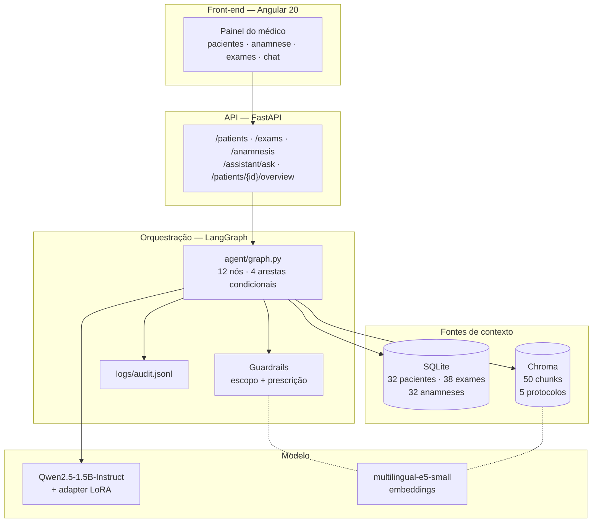
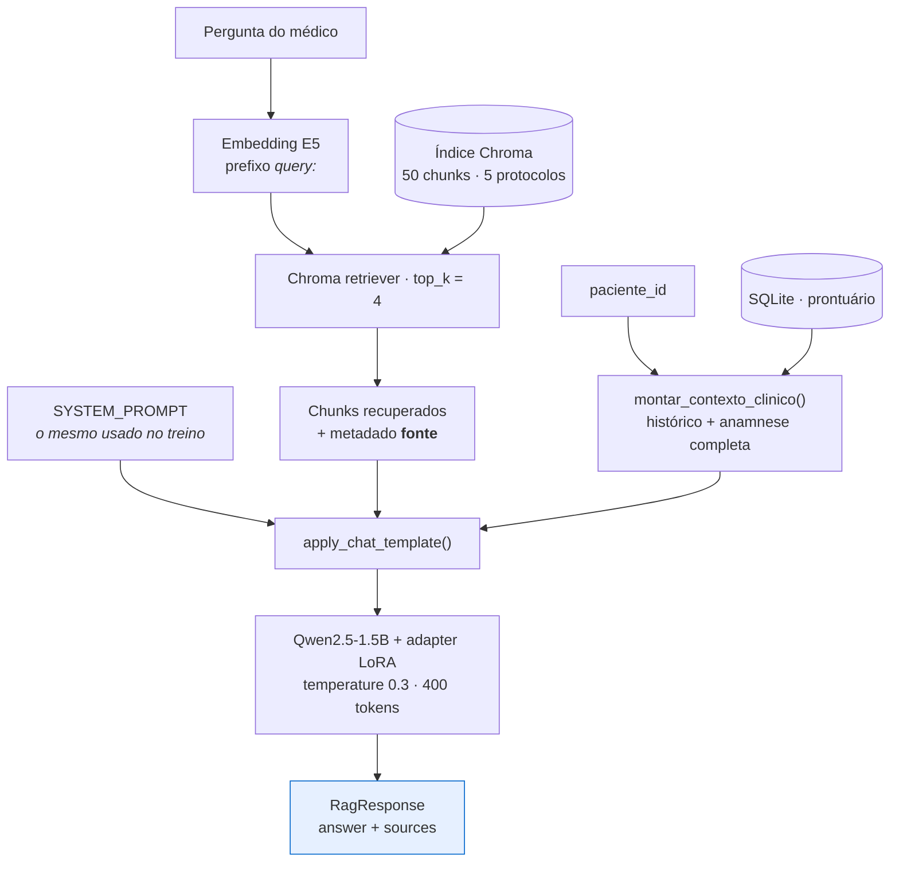
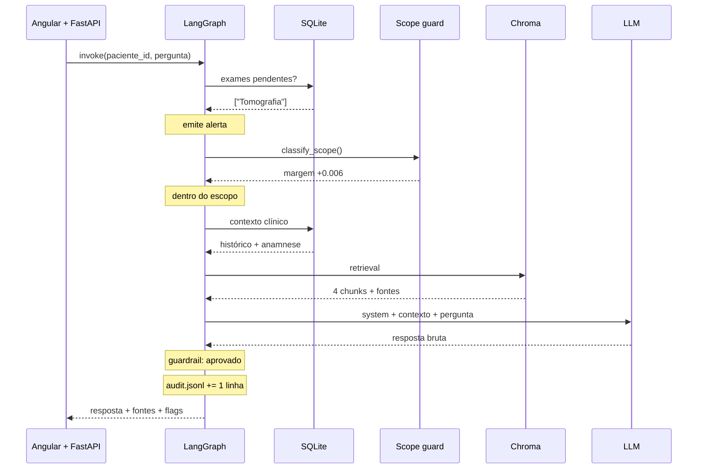

# Relatório Técnico — OncoTech: Assistente Médico Virtual

**Tech Challenge — Fase 3 · Pós-graduação em Inteligência Artificial (FIAP)**
Repositório: `AI-TechChallenge-Step3`

---

## Sumário

1. [Visão geral do sistema](#1-visão-geral-do-sistema)
2. [Processo de fine-tuning](#2-processo-de-fine-tuning)
3. [Descrição do assistente médico](#3-descrição-do-assistente-médico)
4. [Diagrama do fluxo LangChain / LangGraph](#4-diagrama-do-fluxo-langchain--langgraph)
5. [Avaliação do modelo e análise dos resultados](#5-avaliação-do-modelo-e-análise-dos-resultados)
6. [Referências e licenças](#6-referências-e-licenças)

---

## 1. Visão geral do sistema

O sistema é um **assistente médico virtual de apoio à decisão clínica** que atende **todas as especialidades** de um hospital fictício — o "Hospital Vida Nova", cujo painel médico é apresentado sob a marca "Hospital VEinstein". Ele não substitui o julgamento clínico: organiza informação do prontuário, recupera protocolos internos e redige respostas que precisam ser validadas por um profissional habilitado.

O escopo é hospitalar geral. O prontuário eletrônico simulado cobre clínica médica, urgência, ortopedia, pneumologia, cardiologia, endocrinologia, gastroenterologia, urologia, neurologia, otorrinolaringologia, oftalmologia, dermatologia, infectologia, cirurgia geral, ginecologia e oncologia. O assistente é acionado da mesma forma para qualquer um desses casos.

A arquitetura combina três técnicas com papéis distintos:

| Técnica | Papel | Por que é necessária |
|---|---|---|
| **Fine-tuning (QLoRA)** | Estilo, tom clínico, formato de resposta e vocabulário institucional | O modelo base responde com tom de enciclopédia geral; o alvo é o registro clínico do hospital |
| **RAG (LangChain + Chroma)** | Conhecimento factual **citável** — os protocolos internos | Garante rastreabilidade: cada resposta indica de qual protocolo veio a informação |
| **Tools sobre banco estruturado** | Dado do paciente **em tempo real** — histórico, anamnese, exames | Esse dado muda a cada consulta e não pode estar congelado nos pesos do modelo |

A orquestração é feita por um **grafo de estados em LangGraph**, que escolhe o caminho de execução conforme o tipo de interação e o resultado dos guardrails, e registra cada interação em um log de auditoria.

**Números do sistema:**

| Item | Valor |
|---|---|
| Modelo base | `Qwen/Qwen2.5-1.5B-Instruct` (Apache 2.0) |
| Técnica de fine-tuning | QLoRA 4-bit (NF4) + LoRA r=16 |
| Parâmetros treináveis | ≈ 4,36 M (0,28% do total) |
| Dataset de fine-tuning | 55 exemplos (47 treino / 8 validação) |
| Base de conhecimento (RAG) | 5 protocolos → 50 chunks no Chroma |
| Prontuário simulado | 32 pacientes · 30 quadros clínicos distintos · 38 exames · 32 anamneses |
| Grafo LangGraph | 12 nós, 4 arestas condicionais |
| Endpoints da API | 7 |
| Testes automatizados | 38 |

---

## 2. Processo de fine-tuning

### 2.1 Papel do fine-tuning na arquitetura

O que se ajusta no modelo é **comportamento**, não conhecimento. Um modelo de 1,5 bilhão de parâmetros responde perguntas médicas em português com tom de enciclopédia geral e formatação de chatbot. O comportamento-alvo é uma resposta curta, em registro clínico, que enquadre qualquer conduta como sugestão sujeita à validação de um médico responsável e que cite o protocolo em que se apoia.

Esse tipo de ajuste — formato e tom, com pouco conteúdo novo — é o caso em que LoRA/QLoRA com poucas dezenas de exemplos é eficaz, e que o RAG não resolve: o RAG muda o que o modelo *sabe*, não como ele *escreve*.

### 2.2 Dataset

O dataset de fine-tuning é montado a partir de duas pastas em `data/raw/`. Uma terceira pasta, `protocolos/`, alimenta exclusivamente o RAG e não participa do treino:

| Fonte | Arquivos | Papel | Origem |
|---|---:|---|---|
| `faqs/` | 51 | Pares instrução→resposta clínica | **MedQuAD** (NIH) e **PubMedQA**, filtrados para câncer de mama e vertidos para PT-BR |
| `laudos_modelo/` | 5 | Formato e tom de documentos: laudo, parecer, encaminhamento, orientação pós-procedimento | Sintético, escrito para o hospital fictício |
| `protocolos/` | 5 | **Fora do fine-tuning** — base de conhecimento do RAG | Sintético |

A separação entre o material de fine-tuning e o material de RAG é estrutural: protocolo é *conhecimento a consultar e citar*. Treinar o modelo diretamente nos protocolos destruiria a rastreabilidade — ele passaria a "saber" o protocolo sem conseguir apontar a origem da informação, que é o requisito de explainability do desafio.

**Composição das 51 FAQs por sub-base de origem:**

| Prefixo do arquivo | Sub-base | Arquivos |
|---|---|---:|
| `cancergov_` | MedQuAD / CancerGov | 17 |
| `pubmedqa_` | PubMedQA | 15 |
| `seniorhealth_` | MedQuAD / SeniorHealth | 8 |
| `gard_` | MedQuAD / GARD | 5 |
| `ghr_` | MedQuAD / Genetics Home Reference | 3 |
| `mplustopics_` | MedQuAD / MedlinePlus Health Topics | 3 |

O PubMedQA tem formato original de *pergunta de pesquisa + abstract + conclusão sim/não/talvez*, incompatível com um par instrução→resposta clínica. Cada item foi reescrito como pergunta e resposta em prosa, preservando a conclusão do estudo. A tradução e o resumo para PT-BR foram feitos com apoio de LLM, sem revisão por profissional de saúde — o conteúdo é material de estudo, não fonte validada para uso clínico.

**Cobertura temática.** O corpus de fine-tuning está concentrado em oncologia mamária, enquanto o sistema atende o hospital inteiro. Isso não restringe o escopo do assistente — o que o modelo aprende dessas 51 FAQs é o *formato* da resposta clínica, que generaliza para qualquer especialidade — mas é a principal lacuna de cobertura do trabalho, analisada na [seção 5.8](#58-síntese-e-limitações).

**Anonimização.** Não há dado real de paciente em nenhuma etapa. MedQuAD e PubMedQA são bases públicas de conhecimento médico, sem informação identificável. O prontuário simulado é integralmente gerado, com nomes explicitamente fictícios ("Paciente Fictício A" … "Paciente Fictício AF"). A anonimização é estrutural: não existe dado sensível a anonimizar.

### 2.3 Preprocessing e curadoria

`finetuning/prepare_dataset.py` transforma os arquivos Markdown em JSONL no formato Alpaca (`instruction` / `input` / `output`):


Características da implementação:

- **Cabeçalhos tolerantes.** O parser aceita `## Instrução`, `## Pergunta` ou `## Contexto` para a entrada, e `## Resposta`, `## Laudo`, `## Receita`, `## Parecer` ou `## Encaminhamento` para a saída, normalizando acento e caixa. A fonte dos dados pode ser trocada sem alterar o código.
- **Split determinístico** (`RANDOM_STATE = 42`): o conjunto de validação é sempre o mesmo, o que torna as métricas da seção 5 comparáveis entre execuções.
- **Filtro de comprimento mínimo** (20 caracteres na resposta): descarta respostas truncadas na conversão, que ensinariam o modelo a parar cedo.

**Perfil do dataset resultante:**

| Métrica | Valor |
|---|---|
| Exemplos totais | 55 (47 treino / 8 validação) |
| Palavras por instrução | média 15,1 · mín. 8 · máx. 22 |
| Palavras por resposta | média 94,2 · mín. 63 · máx. 138 |
| Volume total de resposta | ≈ 5.200 palavras |

### 2.4 Configuração do treino

**Modelo base: `Qwen/Qwen2.5-1.5B-Instruct`.** A escolha atende a três restrições simultâneas: licença Apache 2.0 sem gate de acesso, suporte multilíngue real a PT-BR, e capacidade de rodar em QLoRA 4-bit na GPU T4 do Colab gratuito.

**QLoRA** — o modelo base é quantizado em 4 bits (NF4, com dupla quantização) e congelado; apenas os adaptadores de baixo posto (LoRA) recebem gradiente.

| Hiperparâmetro | Valor | Justificativa |
|---|---|---|
| `LORA_R` | 16 | Posto suficiente para ajuste de estilo; valores maiores aumentam o risco de overfit em 47 exemplos |
| `LORA_ALPHA` | 32 | Razão α/r = 2 |
| `LORA_DROPOUT` | 0.05 | Regularização leve, apropriada ao dataset pequeno |
| `LORA_TARGET_MODULES` | `q_proj`, `k_proj`, `v_proj`, `o_proj` | Apenas as projeções de atenção; incluir as camadas MLP aumentaria os parâmetros treináveis sem ganho claro para ajuste de tom |
| `LOAD_IN_4BIT` | `True` (NF4 + double quant) | Reduz a memória do modelo base o suficiente para caber na T4 |
| `NUM_TRAIN_EPOCHS` | 3 | Com 47 exemplos, mais épocas memorizam o conjunto |
| Batch efetivo | 8 (2 × 4 de acumulação) | Batch real de 2 cabe na VRAM da T4; a acumulação recupera a estabilidade do gradiente |
| `LEARNING_RATE` | 2e-4 | Padrão para LoRA, bem acima do usado em fine-tuning completo |
| `MAX_SEQ_LENGTH` | 1024 | Acomoda o maior exemplo (system prompt + instrução + resposta) |

**Volume de treino:** 47 exemplos ÷ batch efetivo 8 ≈ 6 passos por época × 3 épocas = **18 passos de otimização**, confirmado pelos checkpoints salvos (`checkpoint-6`, `checkpoint-12`, `checkpoint-18`).

**Parâmetros treináveis:** com r=16 sobre as quatro projeções de atenção, em 28 camadas de um modelo com `hidden_size=1536` e atenção agrupada (12 cabeças de consulta, 2 de chave/valor), o total é ≈ **4,36 milhões de parâmetros**, ou **0,28%** dos ≈ 1,54 bilhão do modelo. O arquivo `adapter_model.safetensors` de 17,4 MB confirma a ordem de grandeza (4,36 M × 4 bytes ≈ 17,4 MB).

**Formatação do prompt.** `SYSTEM_PROMPT` está definido em um único lugar (`finetuning/config.py`) e é usado tanto no treino (`train_qlora.py::build_prompt`) quanto na inferência (`rag/chain.py::ask` e `ask_overview`), sempre através do `apply_chat_template` do tokenizer. Treino e runtime usam exatamente o mesmo template — condição para que o adapter se comporte em produção como se comportou no treino.

O conteúdo do system prompt descreve os mesmos limites que o guardrail de runtime (`agent/guardrails.py`) verifica: o modelo é treinado para respeitar a regra que o sistema fiscaliza.

### 2.5 Execução e artefato

O treino roda na **GPU T4 gratuita do Google Colab** (`finetuning/train_qlora_colab.ipynb`), com o adapter salvo no Google Drive a cada época. Stack: `transformers` + `peft` 0.20 + `trl` 1.12 (`SFTTrainer`) + `bitsandbytes` + `accelerate`.

`finetuning/train_qlora.py` também roda **localmente sem GPU**: detecta a ausência de CUDA e carrega o modelo sem quantização em bfloat16 (LoRA, não QLoRA — `bitsandbytes` 4-bit exige CUDA), habilitando *gradient checkpointing* para compensar a memória. O dtype de computação em GPU é resolvido automaticamente: bfloat16 em Ampere ou superior, float16 na T4, que não suporta bf16 nativamente.

**Artefato final:** `finetuning/adapters/cancer-assistant-lora/` — adapter LoRA de 17,4 MB, tokenizer e chat template. O modelo base não é redistribuído; é baixado do Hugging Face na primeira execução.

---

## 3. Descrição do assistente médico

### 3.1 Modos de operação

O assistente vive dentro do painel do médico (Angular 20) e opera em **dois modos**, com caminhos distintos no grafo:

**Visão geral automática.** Ao abrir a ficha de um paciente, o front-end chama `POST /patients/{id}/overview`. O assistente lê o histórico, a anamnese completa e os exames, e devolve duas listas estruturadas: **pontos relevantes** (síntese do caso) e **pontos de atenção** (riscos, exames pendentes, alergias, interações medicamentosas, divergências entre histórico e conduta). O médico vê isso como um card ao lado da ficha, sem precisar perguntar nada.

**Chat.** O médico faz uma pergunta livre sobre o paciente em consulta (`POST /assistant/ask`). A resposta é ancorada nos protocolos internos recuperados via RAG e traz a lista de protocolos consultados.

Nos dois modos, exames pendentes geram um alerta emitido antes da geração, que acompanha a resposta.

Os dois modos são caminhos separados porque a tarefa é diferente. O chat responde a uma pergunta e precisa de retrieval; a visão geral sintetiza um caso e usa um prompt de saída estruturada, com marcadores fixos `RELEVANTE:` e `ATENCAO:` que o backend converte em duas listas. Os nós comuns — checagem de exames, guardrails, validação humana e auditoria — são compartilhados pelos dois caminhos.

### 3.2 Componentes



| Componente | Tecnologia | Papel |
|---|---|---|
| Orquestração | LangGraph | Grafo de estados; garante que todo caminho passe por guardrail e auditoria |
| Geração | `transformers` + `peft`, via `HuggingFacePipeline` | Modelo base + adapter LoRA, servido em processo |
| Recuperação | LangChain + Chroma | 50 chunks (500 caracteres, overlap 50) dos 5 protocolos, com metadado `fonte` |
| Embeddings | `intfloat/multilingual-e5-small` | Usado no RAG e no guardrail de escopo |
| Prontuário | SQLite | Tabelas `pacientes`, `exames`, `anamnese`; seed idempotente |
| API | FastAPI + Pydantic | Grafo carregado uma vez no `lifespan`, não por requisição |
| Front-end | Angular 20 (standalone + Signals) + Material | Painel do médico |

A família `intfloat/multilingual-e5-*` exige os prefixos `passage:` para documentos e `query:` para buscas. Isso está encapsulado em uma subclasse (`rag/embeddings.py::E5Embeddings`) usada tanto na ingestão quanto na busca — se apenas um dos lados aplicasse o prefixo, a qualidade de recuperação cairia sem gerar erro.

### 3.3 Prontuário eletrônico simulado

Sem acesso a sistema hospitalar real, o prontuário é um SQLite consultado como tool do agente, não embutido no prompt. São **32 pacientes cobrindo 30 quadros clínicos distintos**, cada um com anamnese completa e exames coerentes com o diagnóstico:

| Área | Quadros representados |
|---|---|
| Clínica médica | Hipertensão descompensada, diabetes tipo 2 descompensado, hipotireoidismo, anemia ferropriva, fibromialgia |
| Urgência | Apendicite aguda, cólica renal por litíase ureteral, fratura de rádio distal, suspeita de trombose venosa profunda |
| Pneumologia | Pneumonia adquirida na comunidade, bronquite aguda, crise asmática |
| Infectologia | Síndrome gripal, COVID-19, dengue, infecção do trato urinário, sinusite bacteriana |
| Gastroenterologia | Gastroenterite aguda, doença do refluxo gastroesofágico |
| Cirurgia geral | Hérnia inguinal não complicada |
| Neurologia | Enxaqueca crônica, lombociatalgia com suspeita de hérnia de disco |
| Otorrinolaringologia / Oftalmologia | Otite média aguda, conjuntivite bacteriana |
| Dermatologia | Dermatite de contato alérgica |
| Ginecologia / Oncologia | Nódulo mamário em investigação, cisto mamário benigno, carcinoma ductal invasivo em tratamento |
| Rotina | Paciente hígido, rastreamento ginecológico/mamário |

**Schema:**

- `pacientes` — id, nome fictício, histórico, sexo, data de nascimento. A idade não é coluna: é calculada a partir da data de nascimento a cada consulta, para não desatualizar.
- `exames` — id, paciente, tipo, status (`pendente` / `concluido`), datas de solicitação e realização, resultado, médico solicitante, observações.
- `anamnese` — um registro por paciente: queixa principal, história da doença atual, história patológica pregressa, história familiar, história ginecológica/obstétrica, medicamentos em uso, alergias, cirurgias prévias, hábitos, sinais vitais, peso e altura, exame físico, hipótese diagnóstica e conduta.

O seed é idempotente por id (`INSERT OR IGNORE`): reiniciar a API preenche apenas o que falta, sem duplicar nem sobrescrever, e migra bancos criados por versões anteriores do schema.

### 3.4 API

| Método | Rota | Descrição |
|---|---|---|
| `GET` | `/health` | Status da API e se o grafo foi carregado |
| `GET` | `/patients` | Lista pacientes, com sexo, data de nascimento e idade; `?nome=` filtra por parte do nome |
| `GET` | `/patients/{id}/exams` | Exames do paciente com status e datas |
| `GET` | `/exams/{id}` | Detalhe completo de um exame |
| `GET` | `/patients/{id}/anamnesis` | Ficha de anamnese completa |
| `POST` | `/assistant/ask` | Pergunta livre do médico → resposta + fontes citadas |
| `POST` | `/patients/{id}/overview` | Visão geral automática → `pontos_relevantes` / `pontos_atencao` |

**Convenção de erros:** `503` quando falta um artefato de que o assistente depende (índice do RAG ou adapter fine-tuned), `404` para paciente ou exame inexistente, `500` para o restante.

### 3.5 Segurança, guardrails e explainability

Cinco camadas cobrem os requisitos de limite de atuação, logging e explainability:

**1. System prompt compartilhado.** Um único texto em `finetuning/config.py`, usado no treino e no runtime, com três regras: usar o contexto fornecido; declarar explicitamente quando o contexto for insuficiente; **nunca prescrever diretamente** — sempre enquadrar como recomendação a ser validada por médico responsável.

**2. Guardrail de escopo** (`agent/scope_guard.py`) — camada anterior à geração, aplicada ao caminho do chat. Classifica a pergunta por similaridade de embeddings **antes** de montar o contexto do paciente. A classificação é **relativa**: a pergunta é comparada contra um conjunto de âncoras do domínio clínico e contra um conjunto de âncoras fora do domínio (viagem, veículos, esporte, clima, culinária, finanças), e só é aceita quando a similaridade com o lado clínico supera a do lado fora de escopo por uma margem mínima (`SCOPE_MARGIN`).

A comparação é relativa, e não contra um limiar absoluto, porque o `multilingual-e5-small` produz similaridade alta entre quaisquer duas frases curtas em português apenas pela forma interrogativa e pelo registro formal. Comparar os dois lados cancela esse piso comum e isola o sinal de tópico. Perguntas fora do escopo são desviadas para uma resposta fixa em código, que **nunca chega a ver o prontuário** — o que impede o modelo de misturar dado clínico em uma recusa.

**3. Guardrail de prescrição** (`agent/guardrails.py`) — filtro de expressões regulares aplicado a **toda** resposta, em todos os caminhos, procurando linguagem de prescrição direta (`prescrevo`, `receito`, `tome … mg`, `administre … dose`). A resposta nunca é descartada em silêncio: se algum padrão dispara, ela é marcada com `requer_validacao_humana=True` e recebe um aviso anexado. O médico vê o rascunho, sinalizado.

A opção por regex, e não por classificador de ML, é deliberada: em contexto clínico, um filtro simples e auditável é mais defensável que uma caixa-preta sem explicação. Ele é conservador por construção, preferindo falso-positivo a falso-negativo.

**4. Nó de validação humana.** Respostas sinalizadas passam por um nó dedicado que marca `status="aguardando_validacao_humana"`. O fluxo não é interrompido — a decisão sobre um rascunho sinalizado é do médico, não do sistema.

**5. Explainability em duas frentes.** Toda resposta de chat cita os protocolos recuperados: o metadado `fonte` é preservado desde a leitura do arquivo, antes do chunking, e retorna no campo `fontes` da API. E o log de auditoria (`logs/audit.jsonl`) grava, por interação: timestamp, tipo de interação, paciente, pergunta, decisão e similaridades numéricas do guardrail de escopo, exames pendentes, alerta, fontes citadas, resposta bruta, resposta final, pontos estruturados, padrões sinalizados e status. Uma linha JSON por interação, em modo *append*; falha de escrita do log nunca derruba uma resposta já gerada.

---

## 4. Diagrama do fluxo LangChain / LangGraph

### 4.1 Grafo de decisão (LangGraph)


**Arestas condicionais:**

| Aresta | Decisão baseada em | Caminhos |
|---|---|---|
| `verificar_exames_pendentes` | Consulta ao SQLite | `com_pendencia` → emite alerta · `sem_pendencia` → segue |
| `rotear_geracao` | Campo `tipo_interacao` do estado | `chat` → classificação de escopo · `visao_geral` → geração direta |
| `classificar_escopo` | Similaridade relativa de embeddings | `dentro_do_escopo` → RAG + geração · `fora_de_escopo` → resposta fixa |
| `validar_seguranca` | Resultado do filtro de prescrição | `sinalizado` → validação humana · `aprovado` → finaliza |

Três propriedades que o desenho garante:

1. **`log_auditoria` é terminal e sempre executado.** Não existe caminho de saída que não passe por ele — nem o de recusa por escopo, nem o de resposta sinalizada.
2. **`validar_seguranca` é ponto de convergência obrigatório.** Os três nós de geração (RAG, visão geral, recusa) convergem nele. Nenhuma resposta escapa do guardrail.
3. **`rotear_geracao` é um nó de passagem, sem efeito no estado.** Existe para dar um ponto único de saída aos dois caminhos anteriores (com e sem exame pendente), evitando duplicar a aresta condicional de tipo de interação.

### 4.2 Chain de recuperação e geração (LangChain)



Duas características da implementação:

- **A chain não é uma única `Runnable` LCEL encadeada.** É montada como um dicionário de componentes (`retriever`, `llm_chat`, `llm_overview`, `tokenizer`), porque `ask()` precisa da resposta gerada **e** dos metadados de fonte dos chunks — informação que se perde em uma chain LCEL que devolve apenas a string final. A explainability exigida pelo desafio determina a estrutura da chain.
- **Dois wrappers de pipeline sobre o mesmo modelo.** `llm_chat` (400 tokens) e `llm_overview` (800 tokens) compartilham o mesmo `model` e `tokenizer` carregados: não há peso duplicado em memória, apenas duas configurações de geração. O teto maior da visão geral atende aos seus dois blocos de saída. Ambos aplicam `repetition_penalty=1.15` e `no_repeat_ngram_size=3`.

A visão geral usa uma variante desse fluxo, **sem retrieval**: o insumo é o caso do paciente, não os protocolos do hospital.

### 4.3 Sequência ponta a ponta (chat)



---

## 5. Avaliação do modelo e análise dos resultados

A avaliação tem duas frentes: a **comparação quantitativa** entre modelo base e modelo fine-tuned, e a **medição do comportamento do sistema em operação**, a partir das 68 interações registradas no log de auditoria.

### 5.1 Metodologia da comparação base vs. fine-tuned

`finetuning/evaluate.py` gera, para o mesmo conjunto de perguntas, as respostas do **modelo base sem adapter** e do **modelo base + adapter LoRA**, e calcula métricas comparáveis.

**Conjunto de teste:** as 8 perguntas de `dataset_val.jsonl` — o split de validação, nunca usado para atualizar pesos (o `SFTTrainer` o consome apenas como `eval_dataset` para a loss). Cobre 6 perguntas clínicas e 2 pedidos de geração de documento (encaminhamento para oncologia, orientação pós-biópsia).

**Métricas.** Nenhuma delas mede correção clínica — isso exigiria um médico avaliando as respostas, o que está fora do escopo deste trabalho. Elas medem se o fine-tuning aproximou o **comportamento** do modelo do comportamento-alvo:

| Métrica | O que mede | Direção |
|---|---|---|
| `similaridade_referencia` | Cosseno entre o embedding da resposta gerada e o da resposta de referência (mesmo E5 do RAG). Proxy de "tratou do mesmo assunto", não de "acertou" | maior |
| `taxa_guardrail` | Fração de respostas que o filtro de prescrição sinalizaria. Reusa o mesmo `agent/guardrails.py` do runtime | menor |
| `taxa_ressalva` | Fração de respostas que enquadram explicitamente a informação como sujeita a validação profissional | maior |
| `distinct_3` | Proporção de trigramas distintos. Detecta degeneração por repetição | maior |
| `comprimento_palavras` | Média de palavras por resposta. Indica mudança de regime de verbosidade | — |

**Controles metodológicos:**

- **Geração greedy** (`do_sample=False`) em vez da amostragem usada em runtime (`temperature=0.3`), para que a comparação seja reproduzível. Os números daqui não reproduzem exatamente o que a API responde em operação.
- **Sem RAG**, para isolar o efeito do fine-tuning. As respostas da API passam ainda por retrieval e pelo grafo.
- **Mesmo prompt e mesmo chat template** dos dois lados, idênticos aos do treino. Um template divergente mediria a divergência de template, não o efeito do fine-tuning.
- **Modelos carregados em sequência**, não simultaneamente — em CPU, manter os dois na RAM dobraria o consumo.
- O `multilingual-e5-small` tem piso alto de similaridade entre textos em português: o valor absoluto importa menos que a **diferença** entre base e fine-tuned no mesmo item.

```bash
python finetuning/evaluate.py
# → data/processed/evaluation/evaluation.json   (respostas completas + métricas por item)
# → data/processed/evaluation/evaluation.md     (tabela comparativa)
```

### 5.2 Resultados da comparação

| Métrica | Base | Fine-tuned | Δ |
|---|---:|---:|---:|
| Similaridade com a referência | _a preencher_ | _a preencher_ | |
| Taxa de acionamento do guardrail | _a preencher_ | _a preencher_ | |
| Taxa de ressalva de validação | _a preencher_ | _a preencher_ | |
| Trigramas distintos | _a preencher_ | _a preencher_ | |
| Comprimento médio (palavras) | _a preencher_ | _a preencher_ | |

**Hipóteses declaradas antes da execução**, para que o resultado seja interpretável e não retroajustado:

1. A **taxa de ressalva** deve subir no fine-tuned — é o comportamento mais diretamente ensinado pelo system prompt repetido em 47 exemplos.
2. O **comprimento médio** deve cair — as respostas de referência têm 94 palavras em média, bem menos do que o modelo base produz espontaneamente.
3. A **similaridade com a referência** deve subir modestamente. Uma subida grande seria indício de memorização, não de generalização, com um dataset deste tamanho.
4. Os **trigramas distintos** podem cair no fine-tuned: fine-tuning em dataset pequeno aumenta a propensão a repetição.

### 5.3 Guardrail de escopo

Medição sobre perguntas reais submetidas ao chat, com as similaridades registradas no log de auditoria:

| Pergunta | Sim. clínica | Sim. fora | Margem | Decisão |
|---|---:|---:|---:|---|
| "Devo trocar a vela de ignição do meu carro de 12 em 12 meses?" | 0,847 | 0,921 | −0,075 | rejeitada |
| "Qual o melhor dia para comer feijoada?" | 0,823 | 0,859 | −0,036 | rejeitada |
| "Caso eu queira colocar a sétima janela no meu carro, com quem devo falar?" | 0,848 | 0,875 | −0,027 | rejeitada |
| "Qual cor de janela devo colocar em uma casa no campo?" | 0,810 | 0,829 | −0,019 | rejeitada |
| "Devo lavar o olho com água nesse caso?" | 0,848 | 0,841 | +0,006 | aceita |
| "Andar de bicicleta na Antártica tomando um sorvete é uma boa ideia?" | 0,857 | 0,853 | +0,005 | aceita |

**Análise.** As quatro perguntas claramente de outro domínio são rejeitadas, e a pergunta clínica legítima — sobre a conduta em um paciente com conjuntivite — é aceita. Os números absolutos confirmam o piso do modelo de embeddings: todas as similaridades contra as âncoras clínicas ficam entre 0,81 e 0,86, independentemente do assunto. É a comparação relativa que separa as classes.

A última linha expõe o limite da abordagem: uma pergunta absurda porém semanticamente neutra é aceita com margem de +0,005. E a margem da pergunta clínica legítima é +0,006 — da mesma ordem. **As duas classes não estão separadas por uma margem confortável.** Elevar `SCOPE_MARGIN` para eliminar o falso positivo eliminaria também a pergunta clínica válida.

O guardrail, portanto, resolve o caso comum sem folga de decisão. As três similaridades ficam gravadas no log de auditoria, o que permite recalibrar `SCOPE_MARGIN` com volume maior de perguntas clínicas reais — e é, em si, um exemplo de explainability: a decisão de recusa é um número auditável, não uma opinião do modelo.

### 5.4 Qualidade da recuperação (RAG)

Distribuição das fontes citadas nas 35 recuperações registradas:

| Protocolo | Vezes citado |
|---|---:|
| `protocolo_seg04_contraste` | 20 |
| `protocolo_onco03_seguranca_quimioterapia` | 5 |
| `protocolo_mama02_conduta_birads` | 5 |
| `protocolo_mama01_rastreamento` | 4 |
| `protocolo_onco01_encaminhamento` | 0 |

**Análise.** Um único protocolo concentra 57% das citações, inclusive em casos em que é irrelevante: à pergunta "Devo lavar o olho com água nesse caso?", para um paciente com conjuntivite, o sistema recuperou e citou o protocolo de segurança no uso de contraste iodado em exames de imagem.

A causa é a combinação de uma base pequena com um retriever sem limiar. São 5 documentos e 50 chunks, e o retriever usa `top_k=4` **sem `similarity_score_threshold`**: ele sempre devolve 4 chunks, existam ou não chunks pertinentes. Quando nada é relevante, devolve os quatro menos irrelevantes — e o protocolo de contraste, por conter vocabulário de procedimento e cuidado geral, é sistematicamente o vizinho mais próximo de perguntas genéricas.

Há um efeito colateral favorável: como as fontes são citadas, o problema fica **visível**. Uma citação obviamente inadequada sinaliza ao médico que a resposta não está bem ancorada. Um sistema sem explainability teria o mesmo defeito, em silêncio.

### 5.5 Estabilidade da geração e aderência ao formato

A configuração de geração aplica `repetition_penalty=1.15` e `no_repeat_ngram_size=3` em ambos os pipelines, e tetos de tokens separados por tarefa (400 no chat, 800 na visão geral). Isso reduz — mas não elimina — dois comportamentos característicos de modelos pequenos: loops de repetição e truncamento no meio da resposta. Os valores não foram calibrados contra benchmark; se a qualidade das respostas cair, `repetition_penalty` é o primeiro parâmetro a revisar.

A aderência ao formato de saída pedido à visão geral (`RELEVANTE:` / `ATENCAO:`, itens iniciados por `-`) não é garantida pelo modelo. O parser (`agent/overview_parser.py`) é defensivo por isso:

- **Rótulos tolerantes a variação**: aceita singular e plural, com e sem acento (`RELEVANTES?`, `ATEN[CÇ][AÃ]O(?:ES|S)?`).
- **Três níveis de fallback na extração de itens**: marcadores `-`/`*`; uma linha por item quando não há marcador; enumeração em linha única separada por vírgula ou ponto-e-vírgula.
- **Consolidação de itens redundantes** (`agent/overview_summarizer.py`): quando vários itens compartilham prefixo e sufixo em nível de palavra, são fundidos em um só com as variações separadas por vírgula. A fusão é conservadora e nunca junta achados sem sobreposição textual clara.

O princípio de projeto é tratar o formato como saída não confiável e parseá-la defensivamente, em vez de depender da obediência do modelo ao prompt. Cada regra do parser tem teste de regressão correspondente.

### 5.6 Fidelidade ao contexto

A limitação mais séria do sistema aparece na visão geral. Trecho real do bloco de "pontos de atenção" gerado para o paciente 19, cujo quadro é conjuntivite bacteriana:

> "Hipertensão arterial sistêmica alta (PA 180/100 mmHgg). Não há histórico de diabetes ou colesterol alto. Paciente não está tomando qualquer anticonvulsivo. **Há suspeita de reação adversa a antibióticos. Pacientes com história de câncer devem ter avaliação adicional sobre possíveis complicações. Pacientemente é portador de doença autoimune. Paciência tem histórico de problemas cardíacos familiares.** PacIENTE TEM HIPERTENSÃO ARTERIAL SISTÊMICA ALTA E CONSIDERA APOIAR SEUS DADOS CLÍNICOS COM UMA TECNOLOGIA DE COORDENAÇÃO DOS DADOS DO PACIENTE…"

Quatro problemas distintos em um único parágrafo:

1. **Comorbidades inventadas.** Doença autoimune, histórico familiar cardíaco e suspeita de reação adversa a antibióticos não constam da ficha do paciente.
2. **Degeneração morfológica.** "Paciente" vira "Pacientemente" e depois "Paciência"; "mmHg" vira "mmHgg"; a frase final degenera em caixa alta e perde sentido.
3. **Ruído estrutural.** Negações irrelevantes ("não está tomando qualquer anticonvulsivo") ocupam espaço de pontos de atenção reais.
4. **Fora do alcance do guardrail.** O filtro de prescrição não sinalizou essa resposta, e corretamente: não há linguagem de prescrição nela. O guardrail cobre *prescrição direta*, não *fabricação de fato clínico*. São riscos diferentes, e o sistema endereça apenas um deles.

**Análise.** Esse é o limite estrutural de um modelo de 1,5 bilhão de parâmetros ajustado com 47 exemplos, ao qual se pede síntese analítica sobre um bloco de texto longo. O fine-tuning ensina o formato, não a fidelidade ao contexto. Alucinação de comorbidade é a falha de maior gravidade possível neste sistema, e nenhuma camada atual a detecta.

Enquanto isso não for endereçado, a visão geral deve ser tratada como rascunho a ser lido criticamente, com aviso de interface proporcional a esse risco.

### 5.7 Comportamento agregado do sistema

Das 68 interações registradas, sobre 7 pacientes distintos:

| Indicador | Valor | Leitura |
|---|---:|---|
| Interações totais | 68 | 31 visões gerais, 24 chats, 13 anteriores ao registro de tipo |
| Sinalizadas pelo guardrail de prescrição | 0 | Nenhum falso positivo — e nenhum verdadeiro positivo |
| Encaminhadas para validação humana | 0 | Consequência direta da linha acima |
| Com alerta de exame pendente | 34 (50%) | O nó de exames está exercitado e funcionando |
| Erros de execução do grafo | 0 | Todas chegaram a `status="concluido"` |

**Sobre o guardrail de prescrição nunca ter disparado:** isso não é evidência de que funciona. É evidência de que o modelo fine-tuned não produziu linguagem de prescrição direta nas perguntas submetidas — comportamento desejado, mas que também significa que o filtro **não foi exercitado em operação**. Sua cobertura real é conhecida apenas pelos testes unitários, e o caminho de validação humana no grafo permanece não exercitado com dado real.

**Cobertura de testes:** 38 testes automatizados, todos passando, sobre lógica pura, sem carregar LLM nem modelo de embeddings — guardrail de escopo (7), consolidação de itens (7), parsing da visão geral (11) e métricas de avaliação (12).

### 5.8 Síntese e limitações

| Aspecto | Estado | Evidência |
|---|---|---|
| Pipeline ponta a ponta | ✅ Funcional | 68 interações, 0 erros de execução |
| Fine-tuning | ✅ Concluído | Adapter de 17,4 MB, 3 épocas, 18 passos de otimização |
| Explainability | ✅ Implementada | Fontes citadas em toda resposta de chat; similaridades numéricas no log |
| Prontuário multiespecialidade | ✅ Implementado | 32 pacientes, 30 quadros clínicos distintos |
| Guardrail de escopo | ⚠️ Funciona, sem folga | Margens de +0,005 (falso positivo) vs. +0,006 (caso legítimo) |
| Qualidade de recuperação | ⚠️ Enviesada | 57% das citações em um único protocolo |
| Estabilidade da geração | ⚠️ Contida por parsing defensivo | Repetição e desvio de formato tratados no backend |
| Guardrail de prescrição | ⚠️ Não exercitado | 0 acionamentos em 68 interações |
| Cobertura da base de conhecimento | ❌ Restrita a oncologia mamária | 4 dos 5 protocolos e 51 das 51 FAQs |
| Fidelidade ao contexto | ❌ Falha grave não endereçada | Comorbidades inventadas na visão geral |
| Comparação base vs. fine-tuned | ⏳ Script pronto, execução pendente | `finetuning/evaluate.py` |

**Limitações:**

1. **Cobertura da base de conhecimento.** O prontuário é multiespecialidade, mas a base do RAG e o corpus de fine-tuning são de oncologia mamária. Para um paciente com pneumonia ou apendicite, não há protocolo pertinente a recuperar — o que agrava diretamente o viés de recuperação descrito em 5.4.
2. **Fidelidade ao contexto na visão geral** (5.6) — a mais grave.
3. **Dataset pequeno e desalinhado com uma das tarefas.** 55 exemplos, todos de QA factual e geração de documento; nenhum de síntese de prontuário, que é a tarefa da visão geral.
4. **Tradução automática sem revisão clínica** das 51 FAQs.
5. **Retriever sem limiar de relevância** (`top_k` fixo).
6. **Guardrail de escopo sem folga de decisão** (5.3).
7. **Guardrail de prescrição não exercitado em operação** (5.7).
8. **Avaliação sem julgamento clínico.** Nenhuma métrica deste trabalho mede correção médica.
9. **Sem persistência de estado entre interações.** Não há memória de conversa.
10. **Modelo servido em processo.** `HuggingFacePipeline` dentro do FastAPI: adequado ao escopo acadêmico, não a produção (sem batching, sem escala horizontal).

**Ações indicadas, por prioridade:**

| # | Ação | Justificativa |
|---|---|---|
| 1 | Ampliar a base de protocolos para as demais especialidades presentes no prontuário | Alinha a cobertura do conhecimento ao escopo hospitalar do sistema |
| 2 | Verificação de ancoragem dos pontos gerados contra o contexto do paciente | Ataca a falha de fidelidade (5.6) com custo baixo e de forma determinística |
| 3 | `similarity_score_threshold` no retriever + tratamento explícito de contexto vazio | Ataca o viés de recuperação (5.4) |
| 4 | Executar `evaluate.py` e fechar a tabela de 5.2 | Completa a comparação quantitativa |
| 5 | Ampliar o dataset com exemplos de síntese de prontuário e de outras especialidades | Alinha o treino às tarefas e ao escopo reais |
| 6 | Recalibrar `SCOPE_MARGIN` com volume de perguntas clínicas reais | Requer dado de operação ainda não disponível |
| 7 | Testar Qwen2.5-3B ou 7B | Reduz alucinação e degeneração morfológica |
| 8 | Servir o modelo fora do processo (merge + GGUF + Ollama, ou vLLM) | Desacopla API e inferência |

---

## 6. Referências e licenças

### Dados

- **MedQuAD** — Ben Abacha, A. & Demner-Fushman, D. "A Question-Entailment Approach to Question Answering." *BMC Bioinformatics*, 2019. Licença **CC BY 4.0**. https://github.com/abachaa/MedQuAD
- **PubMedQA** — Jin, Q. et al. "PubMedQA: A Dataset for Biomedical Research Question Answering." 2019. Licença **MIT**. https://github.com/pubmedqa/pubmedqa

Conteúdo derivado, filtrado e vertido para PT-BR com apoio de LLM. Atribuição também registrada em `1.AssistenteMedico/data/raw/faqs/_FONTE.md`.

### Modelos

- **Qwen2.5-1.5B-Instruct** — Qwen Team, Alibaba Cloud. Licença Apache 2.0. https://huggingface.co/Qwen/Qwen2.5-1.5B-Instruct
- **multilingual-e5-small** — Wang, L. et al. "Multilingual E5 Text Embeddings." Licença MIT. https://huggingface.co/intfloat/multilingual-e5-small

### Técnicas

- **LoRA** — Hu, E. et al. "LoRA: Low-Rank Adaptation of Large Language Models." ICLR 2022.
- **QLoRA** — Dettmers, T. et al. "QLoRA: Efficient Finetuning of Quantized LLMs." NeurIPS 2023.

### Bibliotecas

`transformers` · `peft` 0.20 · `trl` 1.12 · `bitsandbytes` · `accelerate` · `datasets` · `langchain` · `langchain-chroma` · `langchain-huggingface` · `langgraph` · `chromadb` · `sentence-transformers` · `fastapi` · `pydantic` · `uvicorn` · `pytest` · Angular 20 · Angular Material 20

### Documentos do projeto

- [`README.md`](README.md) — visão geral do repositório
- [`1.AssistenteMedico/README.md`](1.AssistenteMedico/README.md) — backend: execução, endpoints, avaliação
- [`front/README.md`](front/README.md) — frontend Angular
- [`1.AssistenteMedico/data/raw/README.md`](1.AssistenteMedico/data/raw/README.md) — origem e licenciamento dos dados

---

## Aviso

Projeto acadêmico de pós-graduação. O assistente é ferramenta de **apoio** à decisão clínica — nenhuma resposta deve ser usada como prescrição sem validação de um profissional de saúde habilitado. Os dados de treino foram vertidos para PT-BR automaticamente, sem revisão clínica. O sistema apresenta alucinação documentada (seção 5.6) e **não é adequado para uso clínico real**.
